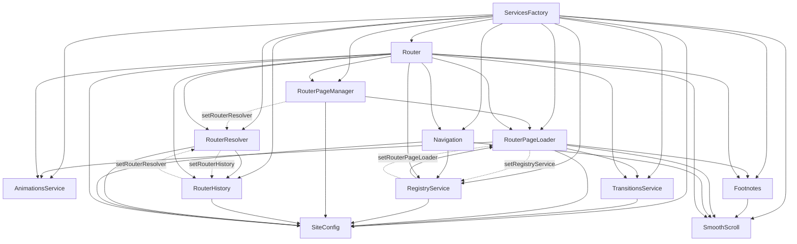
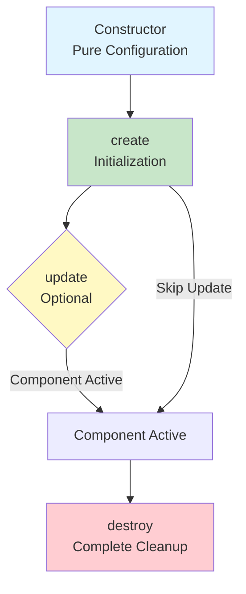
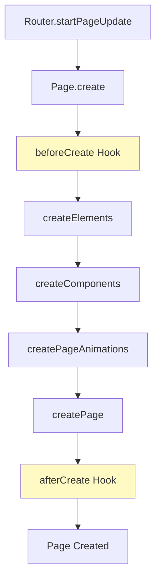
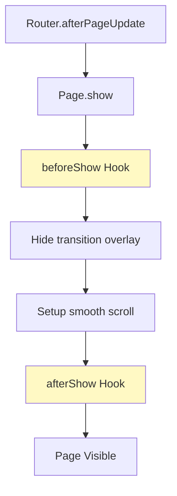
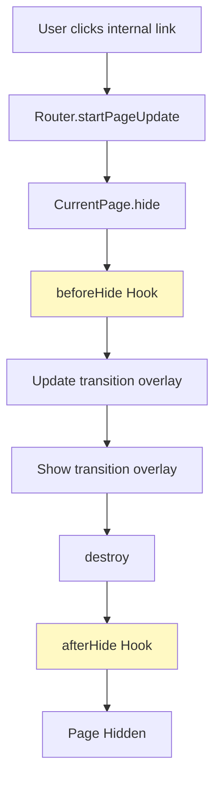
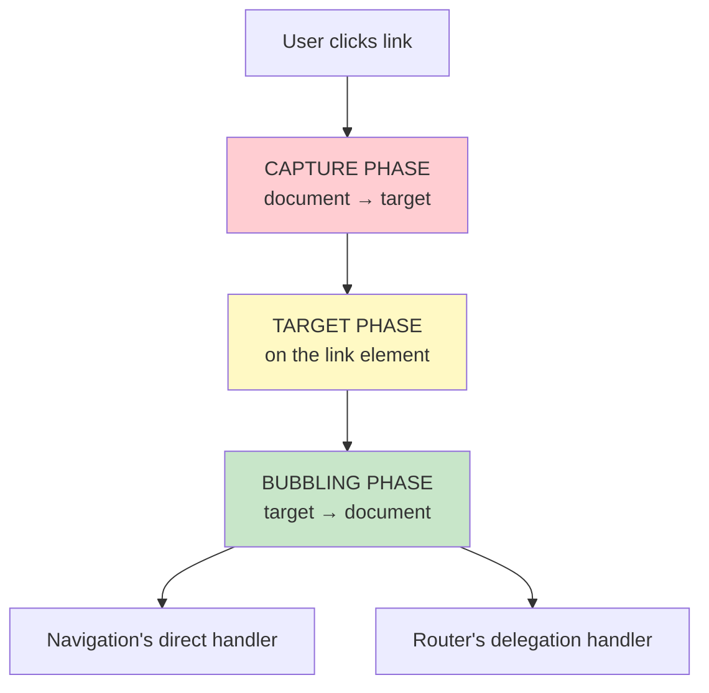
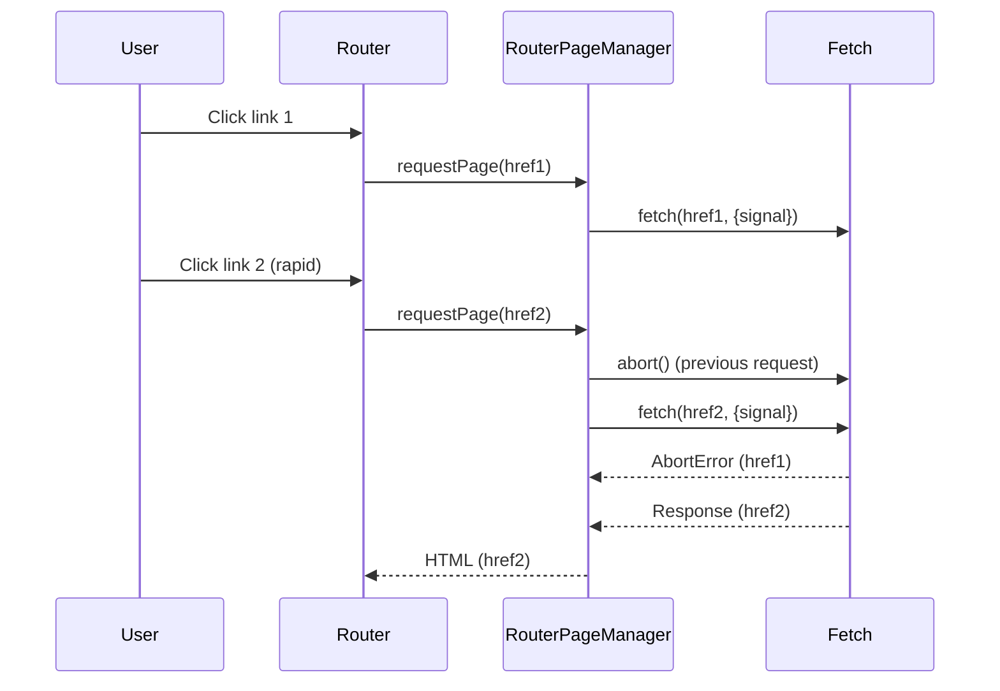
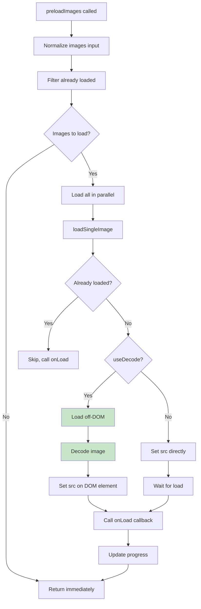
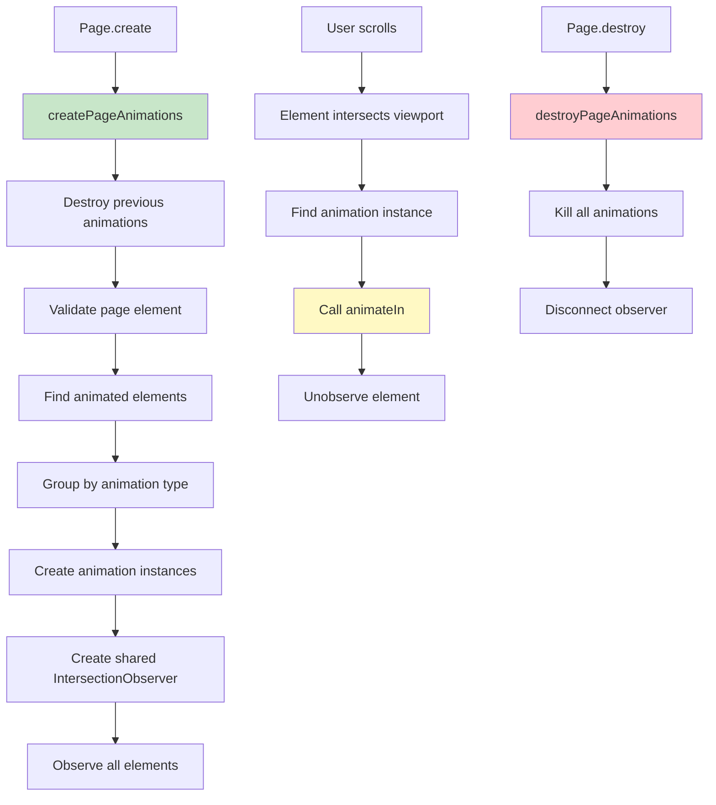
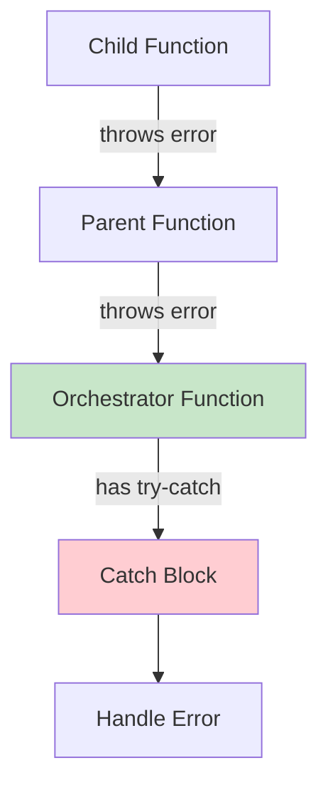

# Comprehensive Developer Guide

A complete reference guide covering all core features, patterns, and best practices for building single-page applications with vanilla JavaScript.

## Table of Contents

### Part 1: Foundation & Architecture
- [Chapter 1: Services & Dependency Injection](#chapter-1-services--dependency-injection)
- [Chapter 2: Document ReadyState](#chapter-2-document-readystate)

### Part 2: Component & Page Lifecycle  
- [Chapter 3: Component Lifecycle](#chapter-3-component-lifecycle)
- [Chapter 4: Page Lifecycle Hooks](#chapter-4-page-lifecycle-hooks)

### Part 3: Event Handling & Async Operations
- [Chapter 5: Event Delegation](#chapter-5-event-delegation)
- [Chapter 6: AbortController](#chapter-6-abortcontroller)

### Part 4: Media & Animations
- [Chapter 7: Image Preloading](#chapter-7-image-preloading)
- [Chapter 8: Animation System](#chapter-8-animation-system)

### Part 5: Error Handling
- [Chapter 9: Error Handling Patterns](#chapter-9-error-handling-patterns)

---

# Part 1: Foundation & Architecture

## Chapter 1: Services & Dependency Injection

### Overview

Dependency Injection (DI) is a design pattern that provides dependencies to a class from outside, rather than having the class create them internally. This guide explains when to use ES6 imports vs dependency injection, and how to structure services in your application.

**Key Concepts:**
- **ES6 imports**: Great for pure utilities, stateless helpers, and stable singletons
- **Dependency Injection**: Better for stateful services, testability, configuration, and lifecycle management
- **Hybrid approach**: Use ES6 imports for utilities, DI for services

### The Spectrum

```
Pure Utilities ←────────────→ Stateful Services
   (imports)                    (injection)

Helpers, Constants         Router, RouterPageManager
Pure Functions             Components with lifecycle
Stateless Classes          Things needing config
```

### When to Use ES6 Imports

**Good Candidates:**
- Pure utilities that don't need configuration
- Constants and configuration values
- Stateless classes with pure utility methods

**Example:**
```javascript
// utilities/DOMHelpers.js
export function $(selector) {
  return document.querySelector(selector);
}

// Usage anywhere
import { $ } from './utilities/DOMHelpers.js';
const el = $('.my-class'); // ✅ Works great!
```

### When to Use Dependency Injection

**Good Candidates:**
- Stateful services with lifecycle (caches, state management)
- Services needing configuration (environment-specific settings)
- Services requiring testability (can mock dependencies)

**Example:**
```javascript
// ❌ BAD: Multiple instances = wasted work
class Page {
  constructor() {
    this.transitionsService = new TransitionsService(); // Creates new instance
  }
}

// ✅ GOOD: Single instance shared via DI
class Page {
  constructor({ transitionsService }) {
    this.transitionsService = transitionsService; // Injected shared instance
  }
}
```

### Service Factory Pattern

The application uses a **Service Factory Pattern** to create and wire all services together. This centralizes service creation and ensures proper dependency management.

**Location:** `app/services/ServicesFactory.js`

**Implementation:**
```javascript
export function createServices() {
  // Phase 1: Create all services (circular dependencies can be undefined initially)
  const siteConfig = new SiteConfig();
  const animationsService = new AnimationsService();
  const transitionsService = new TransitionsService({ 
    siteConfig,
    transitionType: TRANSITION_TYPES.CUSTOM
  });
  const smoothScroll = new SmoothScroll();
  const footnotes = new Footnotes({ smoothScroll });
  const routerPageLoader = new RouterPageLoader({ 
    siteConfig, 
    smoothScroll, 
    animationsManager: animationsService, 
    transitionsManager: transitionsService, 
    footnotes 
  });
  const registryService = new RegistryService({ siteConfig, routerPageLoader });
  const routerPageManager = new RouterPageManager({ siteConfig, routerPageLoader });
  const routerHistory = new RouterHistory({ siteConfig });
  const routerResolver = new RouterResolver({ siteConfig, routerHistory });

  // Phase 2: Wire circular dependencies using setters
  routerPageLoader.setRegistryService(registryService);
  registryService.setRouterPageLoader(routerPageLoader);
  routerHistory.setRouterResolver(routerResolver);
  routerResolver.setRouterHistory(routerHistory);
  routerPageManager.setRouterResolver(routerResolver);
  routerPageManager.setPrefetchCache(prefetchCache);

  // Create remaining services that depend on the wired services
  const navigation = new Navigation({ siteConfig, registryService, smoothScroll });
  const router = new Router({ 
    siteConfig, 
    registryService, 
    routerPageLoader, 
    routerPageManager, 
    routerHistory, 
    routerResolver, 
    smoothScroll, 
    animationsService, 
    transitionsService, 
    footnotes, 
    navigation, 
    prefetchManager 
  });

  return {
    siteConfig,
    router, 
    smoothScroll,
    animationsService,
    transitionsService,
    footnotes,
    registryService,
    routerPageLoader,
    routerPageManager,
    routerHistory,
    routerResolver,
    navigation,
    prefetchCache,
    prefetchManager,
  };
}
```

**Key Benefits:**
- Single point of service creation
- Automatic dependency injection
- Easy to test (can mock services)
- Clear dependency graph
- Handles circular dependencies gracefully

### Service Dependency Graph



### Integration with Page Lifecycle

Services are injected into Page classes through the constructor. See [Chapter 4: Page Lifecycle Hooks](#chapter-4-page-lifecycle-hooks) for how services are used in page initialization.

```javascript
// Services are created once in App.js
const services = createServices();

// Then injected into pages
const page = new Home({
  smoothScroll: services.smoothScroll,
  animationsManager: services.animationsService,
  transitionsManager: services.transitionsService,
  footnotes: services.footnotes,
});
```

### Best Practices

**DO:**
- Use ES6 imports for pure utilities and constants
- Use DI for stateful services and components
- Create services once in a factory function
- Pass services as constructor parameters
- Handle circular dependencies with setters

**DON'T:**
- Create new service instances in every component
- Import stateful services directly
- Hard-code service dependencies
- Create services without a factory pattern

### Related Chapters
- [Chapter 2: Document ReadyState](#chapter-2-document-readystate) - Service initialization timing
- [Chapter 3: Component Lifecycle](#chapter-3-component-lifecycle) - How components receive services
- [Chapter 4: Page Lifecycle Hooks](#chapter-4-page-lifecycle-hooks) - How pages use injected services

---

## Chapter 2: Document ReadyState

### Overview

`document.readyState` is a property that indicates the current loading state of the document. It's a modern, reliable way to check if the DOM is ready without relying solely on event listeners.

### The Three States

| State | DOM Ready? | Scripts Executed? | Resources Loaded? | Use Case |
|-------|------------|-------------------|-------------------|----------|
| `"loading"` | ❌ | Maybe | ❌ | Wait for DOM |
| `"interactive"` | ✅ | ✅ | Maybe | **Most common** - Initialize features |
| `"complete"` | ✅ | ✅ | ✅ | Measure full load, image dimensions |

### Detailed Breakdown

#### `"loading"` State

**What's Complete:**
- ❌ HTML parsing: Still in progress
- ❌ DOM construction: Partial, not safe to query
- ❓ Inline scripts: May have executed if encountered
- ❌ Async/defer scripts: Not executed yet
- ❌ Stylesheets: Not loaded
- ❌ Images: Not loaded

**What You Can Do:**
- ⚠️ **Cannot safely query DOM** - elements may not exist yet
- ✅ Can add event listeners (they'll fire when ready)
- ✅ Can check `document.readyState` to determine next action

#### `"interactive"` State / `DOMContentLoaded` Event

**What's Complete:**
- ✅ **HTML parsing: Complete** - All HTML has been parsed
- ✅ **DOM construction: Complete** - All elements are in the DOM tree
- ✅ **Inline scripts: Executed** - All inline `<script>` tags have run
- ✅ **Synchronous external scripts: Executed**
- ✅ **Async/defer scripts: Executed**
- ⏳ **Stylesheets: May be loading**
- ⏳ **Images: May be loading**

**What You Can Do:**
- ✅ **Safely query DOM** - All elements are available
- ✅ Initialize components, attach event listeners
- ✅ Manipulate DOM elements
- ⚠️ **Cannot rely on image dimensions** - Images may not be loaded yet

**Use Case:** **Most common case** - Initialize features, query elements, set up event listeners

#### `"complete"` State / `window.load` Event

**What's Complete:**
- ✅ **Everything:** HTML, DOM, scripts, stylesheets, images, fonts, iframes

**What You Can Do:**
- ✅ **Get accurate image dimensions**
- ✅ **Get computed styles** - All stylesheets applied
- ✅ **Measure layout** - All resources loaded, layout is final

**Use Case:** Measure full page load, get image dimensions, ensure all resources are ready

### Implementation: `whenDOMReady` Utility

**Location:** `app/utilities/AsyncHelpers.js`

```javascript
/**
 * Waits for the DOM to be ready and then executes the callback
 * @param {Function} callback - The callback to execute when the DOM is ready
 * @returns {void}
 */
export function whenDOMReady(callback) {
  if (document.readyState === "loading") {
    // DOM not ready yet, wait for DOMContentLoaded
    document.addEventListener(EVENTS.DOM_CONTENT_LOADED, callback);
  } else {
    // DOM already loaded (hard refresh), execute immediately
    callback();
  } 
}
```

**Usage:**
```javascript
import { whenDOMReady } from './utilities/AsyncHelpers.js';

whenDOMReady(async () => {
  // DOM is ready, safe to query elements
  const page = new Home(services);
  await page.create();
  await page.show();
});
```

### Decision Guide: Which State Do You Need?

| Your Need | Use State | Why |
|-----------|-----------|-----|
| Query DOM elements | `"interactive"` or `DOMContentLoaded` | DOM is fully constructed |
| Initialize components | `"interactive"` or `DOMContentLoaded` | DOM ready, scripts executed |
| Attach event listeners | `"interactive"` or `DOMContentLoaded` | Elements exist in DOM |
| Get image dimensions | `"complete"` or `window.load` | Images must be loaded |
| Measure layout | `"complete"` or `window.load` | All stylesheets applied |
| Access iframe content | `"complete"` or `window.load` | Iframes fully loaded |

### Best Practices

**DO:**
- Use `whenDOMReady()` for most initialization tasks
- Check `document.readyState` before adding listeners
- Use `"interactive"` for DOM queries and component initialization
- Use `"complete"` only when you need all resources loaded

**DON'T:**
- Assume DOM is ready without checking
- Use `window.load` for basic DOM operations (too late)
- Block initialization waiting for `"complete"` unnecessarily

### Related Chapters
- [Chapter 1: Services & Dependency Injection](#chapter-1-services--dependency-injection) - Service initialization patterns
- [Chapter 3: Component Lifecycle](#chapter-3-component-lifecycle) - Component creation timing
- [Chapter 4: Page Lifecycle Hooks](#chapter-4-page-lifecycle-hooks) - Page initialization timing

---

# Part 2: Component & Page Lifecycle

## Chapter 3: Component Lifecycle

### Overview

All components in the application follow a consistent lifecycle pattern: Constructor → Create → Update (optional) → Destroy. This ensures predictable initialization, proper cleanup, and prevents memory leaks.

### Lifecycle Phases Flow



### Key Principles

1. **Constructor = Pure Configuration**
   - No DOM access
   - No side effects
   - Store selectors and dependencies

2. **Create = Initialization**
   - Idempotent guards
   - DOM access allowed
   - Set up listeners
   - Initialize state

3. **Destroy = Complete Cleanup**
   - Remove all listeners
   - Destroy child components
   - Clear all references
   - Set to null

### Component Base Class

**Location:** `app/components/Component.js`

```javascript
export default class Component extends EventTarget {
  constructor({ element, elements }) {
    super();
    this.selector = element;
    this.selectorChildren = { ...elements };
    this.eventManager = new EventManager();
    this.eventTarget = this.eventManager.getEventTarget();
    this.element = null;
    this.elements = {};
  }

  /**
   * Create a page object of elements
   * Call this method when DOM is ready (typically in subclass create() or setup() methods)
   */
  create() {
    const { element, elements } = createComponentPageObjectFromSelectors(
      this.selector,
      this.selectorChildren
    );
    this.element = element;
    this.elements = elements;
  }

  /**
   * Emit an event with the given type and detail
   */
  emit(type, detail) {
    this.eventManager.emit(type, detail);
  }

  /**
   * Add an event listener for the given event type
   */
  on(type, callback) {
    this.eventManager.on(type, callback);
  }

  /**
   * Register an event handler for the given event type
   */
  registerEvent(type, handler, target) {
    this.eventManager.registerEvent(type, handler, target);
  }

  /**
   * Remove event listeners
   * Call this in destroy() to prevent memory leaks
   */
  removeAllListeners(type) {
    this.eventManager.removeAllListeners(type);
  }

  /**
   * Wrapper around EventManager.addListenerAndRegister
   */
  addListenerAndRegister(target, type, handler, options) {
    this.eventManager.addListenerAndRegister(target, type, handler, options);
  }

  /**
   * Wrapper around EventManager.removeListenerAndDeregister
   */
  removeListenerAndDeregister(target, type, handler) {
    this.eventManager.removeListenerAndDeregister(target, type, handler);
  }
}
```

### Example: Preloader Component

```javascript
import Component from "./Component.js";

export class Preloader extends Component {
  constructor() {
    // ✅ 1. Call super with selectors
    super({
      element: ".preloader",
      elements: {
        title: ".preloader h1",
        counter: ".preloader-counter",
        images: "img[data-src]",
      },
    });
    
    // ✅ 2. Initialize state flags
    this._created = false;
    this._destroyed = false;
    
    // ✅ 3. Initialize component-specific state
    this.imagesLoaded = 0;
    this.percentage = null;
  }

  async create() {
    // ✅ Guard: Prevent duplicate calls
    if (this._created) return;
    
    // ✅ Call super.create() to set up this.element and this.elements
    super.create();
    
    // ✅ Component-specific initialization
    this.setupEventListeners();
    await this.preloadImages();
    
    // ✅ Set flag
    this._created = true;
  }

  setupEventListeners() {
    // ✅ Use addListenerAndRegister for automatic cleanup
    this.addListenerAndRegister(
      window,
      EVENTS.PRELOADER_COMPLETE,
      this.handleComplete.bind(this)
    );
  }

  destroy() {
    // ✅ Guard: Prevent duplicate calls
    if (this._destroyed) return;
    
    // ✅ Remove all event listeners
    this.removeAllListeners();
    
    // ✅ Clear references
    this.element = null;
    this.elements = null;
    
    // ✅ Set flag
    this._destroyed = true;
  }
}
```

### Lifecycle Checklist

**Constructor Checklist:**
- ✅ Call `super()` with selectors
- ✅ Store element selectors (strings)
- ✅ Store child element selectors
- ✅ Accept and store dependencies
- ✅ Initialize state flags (`_created`, `_destroyed`)
- ✅ Initialize empty DOM references (`this.element = null`)

**Create Checklist:**
- ✅ Idempotent guard (check `_created`)
- ✅ Call `super.create()`
- ✅ Verify DOM elements exist
- ✅ Set up event listeners
- ✅ Initialize component state
- ✅ Set `_created = true`

**Destroy Checklist:**
- ✅ Idempotent guard (check `_destroyed`)
- ✅ Remove all event listeners
- ✅ Destroy child components
- ✅ Kill animations/timelines
- ✅ Clear DOM references
- ✅ Set `_destroyed = true`

### Anti-Patterns to Avoid

**❌ DON'T:**
- Access DOM in constructor
- Skip `super.create()` call
- Forget to remove event listeners
- Create components without destroy methods
- Access `this.element` before `create()`
- Call `create()` multiple times without guards

### Related Chapters
- [Chapter 2: Document ReadyState](#chapter-2-document-readystate) - When to call `create()`
- [Chapter 4: Page Lifecycle Hooks](#chapter-4-page-lifecycle-hooks) - Similar lifecycle pattern for pages
- [Chapter 5: Event Delegation](#chapter-5-event-delegation) - Event listener management in components

---

## Chapter 4: Page Lifecycle Hooks

### Overview

The `Page` class implements a hook-based lifecycle system similar to barba.js, allowing subclasses to execute custom code at specific points during page creation, showing, hiding, and destruction.

This system uses optional chaining (`?.()`), meaning hooks are only called if defined in the subclass. This allows subclasses to implement only the hooks they need.

### Lifecycle Hooks

The Page class provides optional lifecycle hooks that subclasses can implement:

**Creation Hooks:**
- `beforeCreate()` - Called before page elements are created
- `afterCreate()` - Called after page is fully initialized

**Visibility Hooks:**
- `beforeShow()` - Called before page becomes visible (before transition hides)
- `afterShow()` - Called after page is visible (after transition completes)
- `beforeHide()` - Called before page hides (before transition shows)
- `afterHide()` - Called after page is hidden (after destroy completes)

**Destruction Hooks:**
- `beforeDestroy()` - Called before page cleanup begins
- `afterDestroy()` - Called after page cleanup completes

### Page Base Class

**Location:** `app/pages/Page.js`

```javascript
export default class Page {
  constructor({
    element,
    elements,
    smoothScroll,
    animationsManager,
    transitionsManager,
    footnotes,
  }) {
    this.selector = element;
    this.selectorChildren = {
      titleAnimations: SELECTORS.TITLE_ANIMATIONS,
      ...elements,
    };
    this.smoothScroll = smoothScroll;
    this.footnotes = footnotes;
    this.animationsManager = animationsManager;
    this.transitionsManager = transitionsManager;
    this._created = false;
    this._destroyed = false;
    this._eventListenersSetup = false;
  }

  async create() {
    if (this._created) {
      console.warn(`Page ${this.id}.create() called multiple times`);
      return;
    }

    await this.beforeCreate?.()
    await this.createElements();    
    await this.createComponents();
    this.createPageAnimations();
    this.createPage();
    this._created = true;
    await this.afterCreate?.()
  }

  async show() {
    await this.beforeShow?.()
    
    if (this.pageTransition) {
      if (this.smoothScroll.isStopped()) {
        this.smoothScroll.start();
        this.smoothScroll.scrollTo(0, { immediate: true }); 
      }
      try { 
        await this.transitionsManager.hidePageTransition(this.pageTransition);
      } catch (error) {
        console.warn(`Page ${this.id}: Transition animation failed, continuing:`, error);
      } finally {
        this.smoothScroll?.unlock?.();
      }
    }
    
    if (this.smoothScroll.isEnabled()) {
      this.smoothScroll.scrollTo(0, { immediate: true });
    } else {
      this.smoothScroll.create();
      this.smoothScroll.scrollTo(0, { immediate: true });
    }

    await this.afterShow?.()
  }

  async hide(route) {
    await this.beforeHide?.();
    await this.transitionsManager.updateTransitionOverlay(route);
    await nextPaint();
    if (this.pageTransition) {
      try {
        await this.transitionsManager.showPageTransition(this.pageTransition);
      } catch (error) {
        console.warn(`Page ${this.id}: Transition animation failed, continuing:`, error);
      }
      this.smoothScroll.scrollTo(0, { immediate: true });
    }
    this.destroy();
    await this.afterHide?.();
  }

  async destroy() {
    if (this._destroyed) {
      console.warn(`Page ${this.id}.destroy() called multiple times`);
      return;
    }

    this._destroyed = true;
    await this.beforeDestroy?.()
    this.destroyPageAnimations();
    this.removeEventListeners();
    this.destroyComponents();
    this.destroyElements();
    await this.afterDestroy?.()
  }
}
```

### Lifecycle Flow Diagrams

#### Page Creation Flow



#### Page Show Flow



#### Page Hide Flow



### Hook Execution Order

**On Page Load:**
1. `beforeCreate()` → `create()` → `afterCreate()`
2. `beforeShow()` → `show()` → `afterShow()`

**On Navigation:**
1. Current page: `beforeHide()` → `hide()` → `afterHide()`
2. New page: `beforeCreate()` → `create()` → `afterCreate()`
3. New page: `beforeShow()` → `show()` → `afterShow()`

**On Page Destroy:**
1. `beforeDestroy()` → `destroy()` → `afterDestroy()`

### Example: Custom Exit Animations with GSAP SplitText

```javascript
import Page from "./Page.js";
import { SplitText } from "gsap/SplitText";

export class CustomPage extends Page {
  async beforeHide() {
    // Animate text out using GSAP SplitText
    const textElements = this.elements.wrapper.querySelectorAll('h1, h2, p');
    const splitTexts = [];
    
    for (const element of textElements) {
      const split = new SplitText(element, { type: "chars" });
      splitTexts.push(split);
      
      gsap.to(split.chars, {
        opacity: 0,
        y: -20,
        duration: 0.3,
        stagger: 0.02,
        ease: "power2.in"
      });
    }
    
    // Animate images out simultaneously
    const images = this.elements.wrapper.querySelectorAll('img');
    gsap.to(images, {
      opacity: 0,
      scale: 0.9,
      duration: 0.4,
      stagger: 0.05,
      ease: "power2.in"
    });
    
    // Wait for animations to complete
    await gsap.to({}, { duration: 0.5 });
    
    // Cleanup SplitText instances
    splitTexts.forEach(split => split.revert());
  }
}
```

**Execution flow:**
1. `beforeHide()` is called when user clicks an internal link
2. Text is split and animated out character by character
3. Images fade and scale out simultaneously
4. After animations complete, the base `hide()` method continues
5. Transition overlay is prepared and shown
6. Page is destroyed

### Example: Custom Entrance Animations

```javascript
import Page from "./Page.js";

export class CustomPage extends Page {
  async afterShow() {
    // Animate content in after transition completes
    const content = this.elements.wrapper;
    gsap.from(content.children, {
      opacity: 0,
      y: 30,
      duration: 0.6,
      stagger: 0.1,
      ease: "power2.out"
    });
  }
}
```

### Best Practices

**DO:**
- Always make hooks `async` if they perform async operations
- Use `beforeHide()` for custom exit animations
- Use `afterShow()` for entrance animations
- Clean up resources in `beforeDestroy()`
- Keep hooks focused on single responsibilities

**DON'T:**
- Access DOM elements in `beforeCreate()` (they don't exist yet)
- Perform heavy operations in `beforeShow()` (blocks page display)
- Forget to await async operations in hooks
- Create side effects that aren't cleaned up

### Integration with Router

The Router orchestrates page lifecycle during navigation. See [Chapter 5: Event Delegation](#chapter-5-event-delegation) for how navigation is triggered, and [Chapter 6: AbortController](#chapter-6-abortcontroller) for handling rapid navigation.

**Router Integration Flow:**
```javascript
// Router.updatePage() orchestrates the lifecycle
async updatePage(href) {
  // 1. Hide current page (calls beforeHide → hide → afterHide)
  await this.currentPage.hide(route);
  
  // 2. Update DOM
  await this.routerPageManager.updatePage(route);
  
  // 3. Create new page (calls beforeCreate → create → afterCreate)
  const newPage = await this.routerPageLoader.getPage(route);
  await newPage.create();
  
  // 4. Show new page (calls beforeShow → show → afterShow)
  await newPage.show();
}
```

### Related Chapters
- [Chapter 3: Component Lifecycle](#chapter-3-component-lifecycle) - Similar lifecycle pattern
- [Chapter 5: Event Delegation](#chapter-5-event-delegation) - How navigation is triggered
- [Chapter 6: AbortController](#chapter-6-abortcontroller) - Preventing race conditions during navigation
- [Chapter 8: Animation System](#chapter-8-animation-system) - Animations created during `createPageAnimations()`

---

# Part 3: Event Handling & Async Operations

## Chapter 5: Event Delegation

### Overview

Event delegation is a technique where you attach a single event listener to a parent element instead of attaching listeners to individual child elements. This is essential for SPAs where content is dynamically loaded and replaced.

### The Problem: Handler Conflicts

When multiple handlers are attached to the same element or event, execution order matters. Direct handlers on elements often execute **before** delegation handlers during bubbling, even if registered later.

### Event Propagation Phases



### Solution: Capture Phase + stopImmediatePropagation

**Router Implementation:**

**Location:** `app/router/Router.js`

```javascript
export class Router {
  setupLinkListeners() {
    // Use capture phase to run BEFORE other handlers
    document.addEventListener(EVENTS.CLICK, (event) => {
      const anchor = this.findInternalLinkAnchor(event);
      
      if (!this.shouldHandleLinkClick(anchor, event)) {
        return;
      }
      
      // Prevent default navigation immediately
      event.preventDefault();
      
      // Stop ALL other handlers from running
      event.stopImmediatePropagation();
      
      // Handle navigation
      const href = anchor.getAttribute(ATTRIBUTES.HREF);
      this.updatePage(href);
    }, { capture: true }); // CRITICAL: Run in capture phase
  }

  findInternalLinkAnchor(event) {
    return event.target.closest(SELECTORS.INTERNAL_LINK);
  }

  shouldHandleLinkClick(anchor, event) {
    if (!anchor) return false;
    if (anchor.getAttribute(ATTRIBUTES.TARGET) === VALUES.TARGET_BLANK) return false;
    if (event.metaKey || event.ctrlKey) return false;
    if (event.button === 1) return false;
    return true;
  }
}
```

### Key Concepts

**Capture Phase (`{ capture: true }`):**
- Executes **before** target phase
- Runs from document → target element
- Ensures your handler runs first

**stopImmediatePropagation():**
- Prevents **all** other handlers on the same element
- More aggressive than `stopPropagation()`
- Use when you want complete control

**Event Delegation:**
- Single listener on parent (document)
- Use `event.target.closest()` to find target
- Works with dynamically added content

### Best Practices

**DO:**
- Use capture phase for critical handlers that must run first
- Call `preventDefault()` synchronously and immediately
- Use `stopImmediatePropagation()` when you need complete control
- Use event delegation for dynamically loaded content
- Check event properties (metaKey, ctrlKey, button) before handling

**DON'T:**
- Call `preventDefault()` after async operations
- Rely on handler registration order
- Attach multiple handlers to the same event without coordination
- Forget to check modifier keys (Cmd/Ctrl for new tab)

### Related Chapters
- [Chapter 4: Page Lifecycle Hooks](#chapter-4-page-lifecycle-hooks) - Navigation triggers page lifecycle
- [Chapter 6: AbortController](#chapter-6-abortcontroller) - Preventing race conditions from rapid clicks
- [Chapter 9: Error Handling Patterns](#chapter-9-error-handling-patterns) - Error handling in navigation flow

### Common Edge Cases

**Edge Case 1: Handler Execution Order**
- **Problem:** Can't predict which handler runs first based on registration order
- **Solution:** Use capture phase or `stopImmediatePropagation()`

**Edge Case 2: Async Operations in Handlers**
- **Problem:** `preventDefault()` must be called synchronously
- **Solution:** Call `preventDefault()` immediately, before any async operations

**Edge Case 3: Dynamically Added Elements**
- **Problem:** Direct handlers don't work on elements added after page load
- **Solution:** Use event delegation on a stable parent element

---

## Chapter 6: AbortController

### Overview

**AbortController** is the native Web API for canceling async operations. It prevents race conditions when users click links rapidly, canceling stale fetch requests, animations, and async operations.

**AbortController** is like a "kill switch" for async operations. When you call `abort()`, it doesn't immediately stop JavaScript execution - instead, it sets a flag that operations can check.

### Why You Need This: The Race Condition Problem

**Scenario: User Clicks Links Rapidly**

```
User clicks: Home → About → Gallery (within 1 second)

Without AbortController:
1. Home navigation starts (fetching /pages/home.html)
2. About navigation starts (fetching /pages/about.html) 
   → Still waiting for home.html ❌
3. Gallery navigation starts (fetching /pages/gallery.html)
   → Still waiting for home.html AND about.html ❌
4. All three complete in wrong order
5. DOM shows wrong page, state is corrupted ❌

With AbortController:
1. Home navigation starts (fetching /pages/home.html)
2. About navigation starts → Aborts home fetch ✅
   → Fetches /pages/about.html
3. Gallery navigation starts → Aborts about fetch ✅
   → Fetches /pages/gallery.html
4. Only gallery completes, shows correct page ✅
```

### Race Condition Hotspots

#### Critical: RouterPageManager.requestPage() - Stale Fetch Requests

**Location:** `app/router/RouterPageManager.js`

**Implementation:**
```javascript
async requestPage(href, { signal, useCache = true } = {}) {
  if (!href) return null;

  if (useCache && this.prefetchCache) {
    const cached = this.prefetchCache.get(href);
    if (cached?.html) {
      return cached.html;
    }
  }

  // Abort any existing fetch request
  if (this.fetchController) {
    this.fetchController.abort();
  }

  // Create new AbortController if signal not provided
  if (!signal) {
    this.fetchController = new AbortController();
    signal = this.fetchController.signal;
  }

  try {
    const response = await fetch(url, { signal });
    
    if (signal?.aborted) {
      throw new DOMException('Aborted', 'AbortError');
    }
    
    if (!response.ok) {
      throw new Error(`HTTP error! status: ${response.status}`);
    }
    
    const html = await response.text();
    
    if (signal?.aborted) {
      throw new DOMException('Aborted', 'AbortError');
    }
    
    return html;
  } catch (error) {
    if (error.name === 'AbortError') {
      console.log('Fetch aborted:', href);
      return null;
    }
    throw error;
  }
}
```

### Complete Flow Diagram



### How Fetch Handles Abort Automatically

When you pass an `AbortSignal` to `fetch()`, the browser automatically:
1. Cancels the network request
2. Rejects the promise with `AbortError`
3. Cleans up resources

**You don't need to manually cancel the request** - `fetch()` handles it automatically.

### Best Practices

**DO:**
- Create new AbortController for each async operation
- Pass `signal` through the entire async chain
- Check `signal.aborted` after each async step
- Handle `AbortError` gracefully (don't treat as failure)
- Abort previous operations when starting new ones

**DON'T:**
- Reuse AbortController across multiple operations
- Ignore `AbortError` (it's expected behavior)
- Forget to check `signal.aborted` in custom async functions
- Create AbortController unnecessarily (only when cancellation needed)

### Related Chapters
- [Chapter 5: Event Delegation](#chapter-5-event-delegation) - Rapid clicks trigger navigation that needs cancellation
- [Chapter 7: Image Preloading](#chapter-7-image-preloading) - Can be canceled with AbortController
- [Chapter 9: Error Handling Patterns](#chapter-9-error-handling-patterns) - Handling AbortError gracefully

### Testing AbortController

```javascript
// Test that abort cancels fetch
const controller = new AbortController();
const promise = fetch('/api/data', { signal: controller.signal });

controller.abort();

try {
  await promise;
} catch (error) {
  console.assert(error.name === 'AbortError');
}
```

---

# Part 4: Media & Animations

## Chapter 7: Image Preloading

### Overview

The `ImageService` provides a comprehensive set of utilities for image preloading, lazy loading, and decode support. It's designed to handle various image loading scenarios with support for progress tracking, decode-before-DOM strategies, and flexible input types.

### Key Features

- **Decode-before-DOM**: Prevents flicker by decoding images off-DOM before setting them on DOM elements
- **Progress Tracking**: Built-in support for progress callbacks during batch loading
- **Flexible Input Types**: Accepts CSS selectors, arrays, NodeLists, or single elements
- **Smart Caching**: Automatically detects and skips already-loaded images
- **Error Handling**: Graceful error handling that doesn't break batch operations

### ImageService API

**Location:** `app/utilities/ImageService.js`

```javascript
export class ImageService {
  constructor() {
    this.preloadedUrls = new Set();
    this.loadingPromises = new Map(); // Track in-flight loads to avoid duplicates
  }

  /**
   * Normalizes various image input types into an array of image elements
   */
  normalizeImages(images, container = document) {
    if (typeof images === 'string') {
      return Array.from(container.querySelectorAll(images));
    }
    if (images instanceof NodeList) {
      return Array.from(images);
    }
    if (Array.isArray(images)) {
      return images;
    }
    if (images) {
      return [images];
    }
    return Array.from(container.querySelectorAll(SELECTORS.LAZY_IMAGES));
  }

  /**
   * Checks if an image is already loaded (cached)
   */
  isImageLoaded(element) {
    return element.complete && element.naturalHeight > 0;
  }

  /**
   * Decodes an image to ensure it's layout-ready
   */
  async decodeImage(element) {
    if (!element.decode) {
      return element; // Fallback for browsers without decode support
    }
    try {
      await element.decode();
      return element;
    } catch (error) {
      console.warn('Image decode failed:', error);
      return element; // Return element anyway
    }
  }

  /**
   * Loads a single image with decode support
   */
  async loadSingleImage({ element, index, useDecode = true, onLoad }) {
    if (!element || !(element instanceof HTMLImageElement)) {
      return null;
    }

    // Skip if already loaded
    if (this.isImageLoaded(element)) {
      onLoad?.(element, index);
      return element;
    }

    const dataSrc = element.getAttribute(ATTRIBUTES.DATA_SRC);
    if (!dataSrc) {
      return null;
    }

    // Check if already preloaded
    if (this.preloadedUrls.has(dataSrc)) {
      element.src = dataSrc;
      element.removeAttribute(ATTRIBUTES.DATA_SRC);
      onLoad?.(element, index);
      return element;
    }

    try {
      if (useDecode) {
        // Load and decode off-DOM first
        const img = await this.loadImageOffDOM(dataSrc);
        await this.decodeImage(img);
        
        // Now set on DOM element (already decoded, no flicker)
        element.src = dataSrc;
        element.removeAttribute(ATTRIBUTES.DATA_SRC);
        this.preloadedUrls.add(dataSrc);
        onLoad?.(element, index);
        return element;
      } else {
        // Traditional loading
        element.src = dataSrc;
        element.removeAttribute(ATTRIBUTES.DATA_SRC);
        await this.waitForElementLoad(element);
        this.preloadedUrls.add(dataSrc);
        onLoad?.(element, index);
        return element;
      }
    } catch (error) {
      console.error('Image load error:', error);
      return null;
    }
  }

  /**
   * Preloads multiple images in parallel with progress tracking
   */
  async preloadImages({
    images,
    container = document,
    onProgress,
    onImageLoad,
    excludePreloader = false,
    useDecode = true,
  } = {}) {
    let normalizedImages = this.normalizeImages(images, container);
    
    if (excludePreloader) {
      normalizedImages = this.excludePreloaderImages(normalizedImages);
    }

    // Filter out already loaded images
    const imagesToLoad = normalizedImages.filter(img => !this.isImageLoaded(img));
    const total = imagesToLoad.length;
    let loaded = 0;

    if (total === 0) {
      onProgress?.(0, 0, 100);
      return { loaded: 0, total: 0, images: normalizedImages };
    }

    // Load all images in parallel
    const loadPromises = imagesToLoad.map((img, index) => {
      return this.loadSingleImage({
        element: img,
        index,
        useDecode,
        onLoad: (loadedImg) => {
          loaded++;
          const percentage = Math.round((loaded / total) * 100);
          onProgress?.(loaded, total, percentage);
          onImageLoad?.(loadedImg, index);
        }
      });
    });

    await Promise.all(loadPromises);

    return {
      loaded,
      total,
      images: normalizedImages
    };
  }
}
```

### Image Loading Flow



### Use Cases

**1. Page Manager - Wait for page images:**
```javascript
async waitForPageReady() {
  await imageService.preloadImages({
    images: SELECTORS.LAZY_IMAGES,
    container: this.pageContainer,
    excludePreloader: true,
    useDecode: true,
  });
  await nextPaint(); // Wait for layout calculation
}
```

**2. Preloader Component - Progress tracking:**
```javascript
await imageService.preloadImages({
  images: this.images,
  excludePreloader: true,
  useDecode: true,
  onProgress: (loaded, total, percentage) => {
    this.imagesLoaded = loaded;
    this.percentage = percentage;
    if (this.elements.counter) {
      this.elements.counter.innerHTML = `${percentage}%`;
    }
  }
});
```

### Decode-Before-DOM Strategy

The `useDecode: true` option prevents flicker by:
1. Loading image off-DOM first
2. Decoding it (making it layout-ready)
3. Setting `src` on DOM element (already decoded, no flicker)

**Benefits:**
- Prevents layout shifts
- Eliminates flicker
- Provides smooth image appearance
- Falls back gracefully if `decode()` not supported

### Best Practices

**DO:**
- Use `useDecode: true` for layout-critical images
- Exclude preloader images from page preloading
- Use progress callbacks for user feedback
- Handle image load errors gracefully
- Cache preloaded URLs to avoid duplicate loads

**DON'T:**
- Preload images that won't be visible
- Block page display waiting for all images
- Forget to handle decode() failures
- Preload images inside preloader (causes circular dependency)

### Integration with Page Lifecycle

Image preloading typically happens during page creation. See [Chapter 4: Page Lifecycle Hooks](#chapter-4-page-lifecycle-hooks) for when to preload images in the page lifecycle.

**Common Pattern:**
```javascript
async afterCreate() {
  // Preload images after page is created
  await imageService.preloadImages({
    images: 'img[data-src]',
    container: this.element,
    useDecode: true,
    onProgress: (loaded, total, percentage) => {
      console.log(`Images loading: ${percentage}%`);
    }
  });
}
```

### Related Chapters
- [Chapter 4: Page Lifecycle Hooks](#chapter-4-page-lifecycle-hooks) - When to preload images
- [Chapter 6: AbortController](#chapter-6-abortcontroller) - Canceling image loads during navigation
- [Chapter 8: Animation System](#chapter-8-animation-system) - Animating images after they load

---

## Chapter 8: Animation System

### Overview

The animation system automatically handles page animations based on `data-animation` attributes in your HTML. It uses a single `IntersectionObserver` per page to efficiently trigger animations when elements enter or leave the viewport.

**Key Components:**
- **`AnimationsService`**: Manages the animation lifecycle, auto-detects animated elements, and coordinates a shared IntersectionObserver
- **`Titles`**: Animation class that fades in title elements when they enter the viewport
- **Page Integration**: `Page.js` calls the manager during create/destroy lifecycle

### How to Set Up a Page Animation

**Step 1: Add `data-animation` Attribute to HTML**

```html
<h2 data-animation="title">My Animated Title</h2>
```

The attribute value (`"title"`) corresponds to an animation class registered in the `AnimationsService` registry.

**Step 2: Automatic Setup**

The system automatically:
- Detects elements with `data-animation` attributes when the page is created
- Creates animation instances for each element
- Sets up a shared IntersectionObserver
- Triggers animations when elements enter/leave the viewport

**No additional code needed in `Page.js`** - it's all handled automatically!

### AnimationsService Architecture

**Location:** `app/services/AnimationsService.js`

```javascript
export class AnimationsService {
  constructor() {
    this.animationRegistry = {
      title: Titles,
      // Future: image: Images, parallax: Parallax
    };
    
    // Current page state
    this.pageAnimations = [];
    this.intersectionObserver = null;
  }

  /**
   * Creates page animations from data-animation attributes
   */
  createPageAnimations(pageElement) {
    this.destroyPageAnimations();
    
    this.validatePageElement(pageElement);
    
    const animatedElements = this.findAnimatedElements(pageElement);
    if (animatedElements.length === 0) {
      return;
    }
    
    const elementsByType = this.groupElementsByType(animatedElements);
    const animations = this.createAnimationInstances(elementsByType);
    
    if (animations.length > 0) {
      this.createSharedIntersectionObserver(animations);
    }
  }

  /**
   * Create a single IntersectionObserver for all page animations
   */
  createSharedIntersectionObserver(animations) {
    // Disconnect previous observer if exists
    if (this.intersectionObserver) {
      this.intersectionObserver.disconnect();
    }

    // Track which elements have already been animated
    const animatedElements = new Set();

    // Create observer with callback that routes to appropriate animation
    this.intersectionObserver = new IntersectionObserver((entries) => {
      entries.forEach((entry) => {
        // Skip if already animated
        if (animatedElements.has(entry.target)) {
          return;
        }

        // Find the animation instance for this element
        const animation = animations.find(anim => anim.element === entry.target);
        
        if (!animation) {
          return;
        }

        if (entry.isIntersecting) {
          animation.animateIn();
          animatedElements.add(entry.target);
          this.intersectionObserver.unobserve(entry.target);
        } else {
          animation.animateOut();
        }
      });
    }, {
      rootMargin: '0px',
      threshold: 0.1
    });

    // Observe all animated elements
    animations.forEach((animation) => {
      if (animation.element && animation.element instanceof HTMLElement) {
        this.intersectionObserver.observe(animation.element);
      }
    });
  }

  /**
   * Destroy all page animations and reset state
   */
  destroyPageAnimations() {
    // Kill all animation instances
    this.pageAnimations.forEach((animation) => {
      try {
        if (typeof animation.kill === 'function') {
          animation.kill();
        }
      } catch (error) {
        console.error('Error killing animation:', error);
      }
    });

    // Disconnect intersection observer
    if (this.intersectionObserver) {
      this.intersectionObserver.disconnect();
      this.intersectionObserver = null;
    }

    // Reset array
    this.pageAnimations = [];
  }
}
```

### Animation Discovery and Execution Flow



### Example: Titles Animation

**Location:** `app/animations/Titles.js`

```javascript
export class Titles {
  constructor(element) {
    if (!element || !(element instanceof HTMLElement)) {
      console.warn('Titles: Invalid element');
      this.element = null;
      this.animationTimelines = [];
      return;
    }

    this.element = element;
    this.animationTimelines = [];
  }

  /**
   * Called when element enters viewport
   */
  animateIn() {
    if (!this.element) return;

    const timeline = gsap.timeline();
    
    timeline.fromTo(
      this.element,
      {
        opacity: 0,
        y: 30,
      },
      {
        opacity: 1,
        y: 0,
        duration: 1,
        ease: "power2.out",
      }
    );

    this.animationTimelines.push(timeline);
    return timeline;
  }

  /**
   * Called when element leaves viewport
   */
  animateOut() {
    if (!this.element) return;

    const timeline = gsap.timeline();
    
    timeline.set(this.element, {
      opacity: 0,
    });

    this.animationTimelines.push(timeline);
    return timeline;
  }

  /**
   * Clean up animation (required)
   */
  kill() {
    if (this.animationTimelines && this.animationTimelines.length > 0) {
      this.animationTimelines.forEach((timeline) => {
        try {
          timeline.kill();
        } catch (error) {
          console.error('Titles#kill: Error killing timeline:', error);
        }
      });
      this.animationTimelines = [];
    }
  }
}
```

### Key Design Patterns

**1. Single IntersectionObserver Pattern**
- One observer watches all animated elements
- Much more performant than one observer per element
- Shared callback routes to appropriate animation instance

**2. Registry Pattern**
- Animation types registered in `animationRegistry`
- Easy to add new types without modifying core logic
- Maps `data-animation` value to animation class

**3. Factory Pattern**
- `createAnimationInstances()` acts as a factory
- Creates instances based on registry mapping
- Handles errors gracefully

**4. Pure Functions**
- `validatePageElement`, `findAnimatedElements`, `groupElementsByType`
- No side effects
- Predictable outputs
- Easily testable

### Animation Instance Lifecycle

1. **Construction**: Element is passed to constructor, timelines array is initialized
2. **Registration**: Instance is added to `AnimationsService.pageAnimations`
3. **Observation**: Element is observed by the shared IntersectionObserver
4. **Animation**: `animateIn()` or `animateOut()` is called when element intersects viewport
5. **Cleanup**: `kill()` is called on page destroy to clean up all timelines

### Example Flow

**HTML:**
```html
<main data-template="section-1">
  <h2 data-animation="title">First Title</h2>
  <h2 data-animation="title">Second Title</h2>
</main>
```

**Execution Flow:**
1. `Page.create()` is called
2. `Page.createPageAnimations()` calls `AnimationsService.createPageAnimations(mainElement)`
3. Service finds 2 elements with `data-animation="title"`
4. Service groups them: `Map { 'title' => [h2, h2] }`
5. Service creates 2 `Titles` instances, one per element
6. Service creates a single IntersectionObserver
7. Observer watches both h2 elements
8. When user scrolls and first h2 enters viewport → `Titles.animateIn()` is called
9. When user navigates away → `AnimationsService.destroyPageAnimations()` kills both instances

### Best Practices

**DO:**
- Always implement `kill()` method for cleanup
- Store animation timelines in arrays for batch cleanup
- Use IntersectionObserver for scroll-triggered animations
- Register custom animations with AnimationsService for automatic cleanup
- Validate elements in constructor

**DON'T:**
- Create one observer per element (use shared observer)
- Forget to kill animations on destroy
- Animate elements that aren't in viewport
- Access DOM elements before they exist

### Integration with Page Lifecycle

Animations are automatically created during `Page.createPageAnimations()`, which is called from `Page.create()`. See [Chapter 4: Page Lifecycle Hooks](#chapter-4-page-lifecycle-hooks) for the complete page lifecycle.

**Lifecycle Integration:**
```javascript
// Page.create() calls createPageAnimations()
async create() {
  await this.createElements();
  await this.createComponents();
  this.createPageAnimations(); // ← Animations created here
  this.createPage();
}

// Page.destroy() calls destroyPageAnimations()
async destroy() {
  this.destroyPageAnimations(); // ← Animations cleaned up here
  this.removeEventListeners();
  this.destroyComponents();
}
```

### Related Chapters
- [Chapter 4: Page Lifecycle Hooks](#chapter-4-page-lifecycle-hooks) - When animations are created and destroyed
- [Chapter 7: Image Preloading](#chapter-7-image-preloading) - Preloading images before animating them
- [Chapter 9: Error Handling Patterns](#chapter-9-error-handling-patterns) - Error handling in animation creation

---

# Part 5: Error Handling

## Chapter 9: Error Handling Patterns

### Overview

Error handling in JavaScript follows specific propagation rules. Understanding when and where to use try-catch blocks is crucial for building robust applications.

### Key Principle: Error Propagation

**Rule 1: Errors bubble up the call stack**
- Errors thrown in child functions propagate to parent functions
- If not caught, they continue bubbling up until caught or reach global scope

**Rule 2: Try-catch catches errors from the entire call chain**
- A try-catch block catches errors from all functions called within it
- You don't need try-catch in every function - let errors bubble to orchestrator

### When to Use Try-Catch

**Use try-catch for: Operations that can throw errors**

#### 1. Async Operations (fetch, promises, async/await)

```javascript
// ✅ GOOD: Wrap async operations
async requestPage(href) {
  try {
    const res = await fetch(href);
    if (!res.ok) {
      throw new Error(`Failed to fetch: ${res.status}`);
    }
    return await res.text();
  } catch (error) {
    // Handle network errors, timeouts, CORS issues
    console.error('Fetch error:', error);
    throw error; // Re-throw to parent
  }
}
```

#### 2. Animations (GSAP timelines, animation errors)

```javascript
// ✅ GOOD: Wrap animation operations
async showPageTransition(element) {
  try {
    const timeline = gsap.timeline({
      onComplete: () => resolve(),
    });
    
    timeline.to(element, {
      opacity: 1,
      duration: 0.5
    });
  } catch (error) {
    // Handle GSAP errors, invalid properties, missing elements
    console.warn('Animation error:', error);
    // Continue execution - page should still show
    resolve(); // Don't block page display
  }
}
```

#### 3. DOM Updates (querySelector, DOM manipulation)

```javascript
// ✅ GOOD: DOM operations that can fail
async updateDOM(html) {
  try {
    const newPageDOM = new DOMParser().parseFromString(html, "text/html");
    const newPage = newPageDOM.querySelector("main");
    
    if (!newPage) {
      throw new Error("No main element found in page HTML");
    }
    
    this.pageContainer.replaceChildren(newPage);
    return this.pageContainer;
  } catch (error) {
    console.error('DOM update error:', error);
    throw error;
  }
}
```

### When NOT to Use Try-Catch

**Don't use try-catch for: Operations that don't throw errors**

#### 1. Simple Property Access (when null/undefined is expected)

```javascript
// ❌ BAD: Unnecessary try-catch
try {
  const value = obj.property;
} catch (error) {
  // This won't throw - property access returns undefined
}

// ✅ GOOD: Use optional chaining
const value = obj?.property;
```

#### 2. Simple Assignments and Variable Declarations

```javascript
// ❌ BAD: Unnecessary try-catch
try {
  const x = 5;
  let y = 10;
} catch (error) {
  // These never throw
}

// ✅ GOOD: No try-catch needed
const x = 5;
let y = 10;
```

### Error Registry

**Location:** `app/utilities/ErrorRegistry.js`

```javascript
export const ERROR_CODES = {
  ELEMENT_NOT_FOUND: 'ELEMENT_NOT_FOUND',
  PAGE_NOT_FOUND: 'PAGE_NOT_FOUND',
  CLASS_NOT_FOUND: 'CLASS_NOT_FOUND',
  NETWORK_ERROR: 'NETWORK_ERROR',
  VALIDATION_ERROR: 'VALIDATION_ERROR',
};

export const ERROR_MESSAGES = {
  [ERROR_CODES.ELEMENT_NOT_FOUND]: 'Element not found: {element}',
  [ERROR_CODES.PAGE_NOT_FOUND]: 'Page not found: {page}',
  [ERROR_CODES.CLASS_NOT_FOUND]: 'Class not found: {className}',
  [ERROR_CODES.NETWORK_ERROR]: 'Network error: {message}',
  [ERROR_CODES.VALIDATION_ERROR]: 'Validation error: {message}',
};

/**
 * Create an error with a specific error code and context
 */
export function createError(code, context = {}) {
  let message = ERROR_MESSAGES[code] || 'An unknown error occurred';
  
  // Replace placeholders with context values
  message = message.replace(/\{(\w+)\}/g, (match, key) => {
    return context[key] !== undefined ? String(context[key]) : match;
  });
  
  const error = new Error(message);
  error.code = code;
  error.context = context;
  return error;
}

/**
 * Check if an error has a specific error code
 */
export function isErrorCode(error, code) {
  return error?.code === code;
}
```

**Usage:**
```javascript
import { createError, ERROR_CODES } from '../utilities/ErrorRegistry.js';

async createElements() {
  this.element = $(SELECTORS.MAIN_WITH_TEMPLATE);
  if (!this.element) {
    throw createError(ERROR_CODES.ELEMENT_NOT_FOUND, { 
      element: `data-template attribute on ${this.selector}` 
    });
  }
}
```

### Error Propagation Flow



### Decision Matrix

| Operation Type | Can Throw? | Use Try-Catch? | Example |
|----------------|------------|----------------|---------|
| `fetch()` | ✅ Yes | ✅ Yes | Network requests |
| `JSON.parse()` | ✅ Yes | ✅ Yes | Parsing data |
| `gsap.timeline()` | ✅ Yes | ✅ Yes | Animation creation |
| `querySelector()` | ❌ No | ❌ No | Returns null, doesn't throw |
| Property access | ❌ No | ❌ No | Returns undefined |
| Simple assignment | ❌ No | ❌ No | Never throws |
| `await import()` | ✅ Yes | ✅ Yes | Dynamic imports |

### Best Practices

**DO:**
- Use try-catch in orchestrator functions (like `updatePage`)
- Let errors bubble up from child functions
- Use ErrorRegistry for consistent error codes
- Re-throw errors after logging/transformation
- Handle `AbortError` separately (it's expected)

**DON'T:**
- Nest try-catch blocks unnecessarily
- Use try-catch for operations that don't throw
- Swallow errors without logging
- Catch errors just to ignore them
- Use try-catch for control flow

### Integration with Other Features

Error handling is integrated throughout the application:

**With AbortController:**
```javascript
try {
  await fetch(url, { signal });
} catch (error) {
  if (error.name === 'AbortError') {
    // Expected cancellation, not a real error
    return;
  }
  // Handle actual errors
  throw error;
}
```

**With Page Lifecycle:**
```javascript
async show() {
  try {
    await this.transitionsManager.hidePageTransition(this.pageTransition);
  } catch (error) {
    // Continue execution - page should still show even if animation fails
    console.warn('Transition failed, continuing:', error);
  }
}
```

### Related Chapters
- [Chapter 4: Page Lifecycle Hooks](#chapter-4-page-lifecycle-hooks) - Error handling in page lifecycle
- [Chapter 6: AbortController](#chapter-6-abortcontroller) - Distinguishing AbortError from real errors
- [Chapter 8: Animation System](#chapter-8-animation-system) - Error handling in animation creation

### Router Error Handling Pattern

**Location:** `app/router/Router.js`

```javascript
async updatePage(href) {
  try {
    // Validate route
    const routeInfo = await this.beforePageUpdate(href);
    if (!routeInfo.isValid) {
      return;
    }

    // Update page
    await this.startPageUpdate(routeInfo, true);
    
    // Get new page instance
    const nextPageInstance = this.registryService.getCurrentPage();
    
    // Show new page
    await this.afterPageUpdate(nextPageInstance, routeInfo);
  } catch (error) {
    // Handle all errors from orchestrated steps
    console.error('Page update error:', error);
    
    // Fallback: redirect to home on critical errors
    if (isErrorCode(error, ERROR_CODES.NETWORK_ERROR)) {
      this.updatePage('/');
    }
  }
}
```

**Key Points:**
- Single try-catch at orchestrator level
- Child functions (`beforePageUpdate`, `startPageUpdate`, `afterPageUpdate`) don't have try-catch
- Errors bubble up naturally
- Orchestrator handles all errors consistently

---

## Quick Reference

### Service Creation
```javascript
import { createServices } from './services/ServicesFactory.js';

// Create all services once
const services = createServices();

// Access individual services
const { router, smoothScroll, animationsService } = services;
```

### DOM Ready Check
```javascript
import { whenDOMReady } from './utilities/AsyncHelpers.js';

whenDOMReady(() => {
  // DOM is ready, safe to query elements
  const page = new Home(services);
  page.create();
});
```

### Component Lifecycle
```javascript
import Component from './components/Component.js';

class MyComponent extends Component {
  constructor() {
    super({ 
      element: '.my-component', 
      elements: {
        button: '.my-component__button',
        content: '.my-component__content'
      } 
    });
    this._created = false;
    this._destroyed = false;
  }
  
  create() {
    if (this._created) return;
    super.create(); // Sets up this.element and this.elements
    this.setupEventListeners();
    this._created = true;
  }
  
  setupEventListeners() {
    this.addListenerAndRegister(
      this.elements.button,
      'click',
      this.handleClick.bind(this)
    );
  }
  
  destroy() {
    if (this._destroyed) return;
    this.removeAllListeners();
    this.element = null;
    this.elements = null;
    this._destroyed = true;
  }
}
```

### Page Lifecycle Hooks
```javascript
import Page from './pages/Page.js';

class MyPage extends Page {
  constructor(options) {
    super({
      element: '.my-page',
      elements: { wrapper: '.page-content' },
      ...options
    });
  }

  async create() {
    await super.create(); // Always await super.create()
    // Custom initialization
  }

  // Optional hooks - only implement what you need
  async beforeCreate() { 
    // Setup before elements are created
  }
  
  async afterCreate() { 
    // Setup after page is fully created
  }
  
  async beforeShow() { 
    // Pre-show logic (before transition hides)
  }
  
  async afterShow() { 
    // Post-show logic (after transition completes)
  }
  
  async beforeHide() { 
    // Exit animations (before transition shows)
  }
  
  async afterHide() { 
    // Post-hide cleanup
  }
  
  async beforeDestroy() { 
    // Pre-destroy cleanup
  }
  
  async afterDestroy() { 
    // Post-destroy cleanup
  }
}
```

### Event Delegation
```javascript
// Router pattern: Capture phase + stopImmediatePropagation
document.addEventListener('click', (event) => {
  const anchor = event.target.closest('.internal-link');
  
  if (!anchor) return;
  if (anchor.target === '_blank') return;
  if (event.metaKey || event.ctrlKey) return;
  
  event.preventDefault();
  event.stopImmediatePropagation();
  
  // Handle navigation
  const href = anchor.getAttribute('href');
  router.updatePage(href);
}, { capture: true }); // CRITICAL: Capture phase
```

### AbortController
```javascript
// Cancel stale fetch requests
class PageManager {
  constructor() {
    this.fetchController = null;
  }

  async requestPage(href) {
    // Abort previous request
    this.fetchController?.abort();
    
    // Create new controller
    this.fetchController = new AbortController();
    const { signal } = this.fetchController;
    
    try {
      const response = await fetch(href, { signal });
      const html = await response.text();
      
      if (signal.aborted) {
        throw new DOMException('Aborted', 'AbortError');
      }
      
      return html;
    } catch (error) {
      if (error.name === 'AbortError') {
        return null; // Expected cancellation
      }
      throw error;
    }
  }
}
```

### Image Preloading
```javascript
import { ImageService } from './utilities/ImageService.js';

const imageService = new ImageService();

// Basic preloading
await imageService.preloadImages({
  images: 'img[data-src]',
  useDecode: true
});

// With progress tracking
await imageService.preloadImages({
  images: document.querySelectorAll('img[data-src]'),
  useDecode: true,
  excludePreloader: true,
  onProgress: (loaded, total, percentage) => {
    console.log(`Loading: ${percentage}%`);
  },
  onImageLoad: (img, index) => {
    console.log(`Image ${index} loaded`);
  }
});

// Single image
await imageService.loadSingleImage({
  element: document.querySelector('#hero-image'),
  useDecode: true,
  onLoad: (img) => {
    console.log('Hero image loaded');
  }
});
```

### Animation Setup
```html
<!-- HTML: Add data-animation attribute -->
<h2 data-animation="title">Animated Title</h2>
<p data-animation="title">Another animated element</p>

<!-- No JavaScript needed - automatic! -->
```

```javascript
// Creating custom animation class
export class MyAnimation {
  constructor(element) {
    this.element = element;
    this.animationTimelines = [];
  }

  animateIn() {
    const timeline = gsap.timeline();
    timeline.fromTo(
      this.element,
      { opacity: 0, y: 30 },
      { opacity: 1, y: 0, duration: 1 }
    );
    this.animationTimelines.push(timeline);
    return timeline;
  }

  animateOut() {
    const timeline = gsap.timeline();
    timeline.set(this.element, { opacity: 0 });
    this.animationTimelines.push(timeline);
    return timeline;
  }

  kill() {
    this.animationTimelines.forEach(t => t.kill());
    this.animationTimelines = [];
  }
}

// Register in AnimationsService
this.animationRegistry = {
  title: Titles,
  'my-animation': MyAnimation, // Add your animation
};
```

### Error Handling
```javascript
import { createError, ERROR_CODES, isErrorCode } from './utilities/ErrorRegistry.js';

// Creating errors with codes
if (!element) {
  throw createError(ERROR_CODES.ELEMENT_NOT_FOUND, { 
    element: selector 
  });
}

// Handling errors
try {
  await riskyOperation();
} catch (error) {
  // Handle AbortError separately (expected cancellation)
  if (error.name === 'AbortError') {
    return; // Not a real error
  }
  
  // Check error codes
  if (isErrorCode(error, ERROR_CODES.NETWORK_ERROR)) {
    // Handle network errors
    console.error('Network error:', error);
  }
  
  // Re-throw if needed
  throw error;
}

// Orchestrator pattern (single try-catch)
async updatePage(href) {
  try {
    await this.beforePageUpdate(href);
    await this.startPageUpdate(routeInfo);
    await this.afterPageUpdate(newPage);
  } catch (error) {
    // Handle all errors from orchestrated steps
    console.error('Page update failed:', error);
  }
}
```

### Common Patterns

**Service Injection:**
```javascript
// Services created once
const services = createServices();

// Injected into pages/components
const page = new Home({
  smoothScroll: services.smoothScroll,
  animationsManager: services.animationsService,
  transitionsManager: services.transitionsService,
  footnotes: services.footnotes,
});
```

**Lifecycle Guard Pattern:**
```javascript
async create() {
  if (this._created) {
    console.warn('Already created');
    return; // Idempotent guard
  }
  // ... initialization
  this._created = true;
}
```

**Event Listener Cleanup:**
```javascript
// Register with tracking
this.addListenerAndRegister(element, 'click', handler);

// Cleanup in destroy
destroy() {
  this.removeAllListeners(); // Removes all tracked listeners
}
```

**Abort-Aware Async Chain:**
```javascript
async doWork({ signal } = {}) {
  await step1();
  if (signal?.aborted) return;
  
  await step2();
  if (signal?.aborted) return;
  
  await step3();
}
```

---

## Index

### Key Concepts
- **Dependency Injection**: Passing dependencies to classes from outside
- **Service Factory**: Centralized service creation pattern
- **Lifecycle Hooks**: Optional methods called at specific points
- **Event Delegation**: Single listener on parent for multiple children
- **AbortController**: Native API for canceling async operations
- **Decode-before-DOM**: Image loading strategy to prevent flicker
- **IntersectionObserver**: Efficient viewport intersection detection
- **Error Propagation**: How errors bubble up the call stack

### Common Patterns
- **Registry Pattern**: Map-based lookup for classes/types
- **Factory Pattern**: Centralized object creation
- **Observer Pattern**: Event-driven communication
- **Singleton Pattern**: Single shared instance
- **Guard Pattern**: Idempotent checks before operations

### File Locations
- Services: `app/services/`
- Components: `app/components/`
- Pages: `app/pages/`
- Utilities: `app/utilities/`
- Router: `app/router/`
- Animations: `app/animations/`

---

*Last updated: January 2026*
