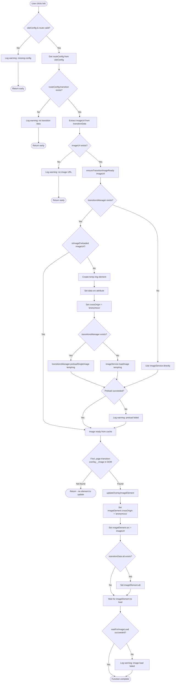
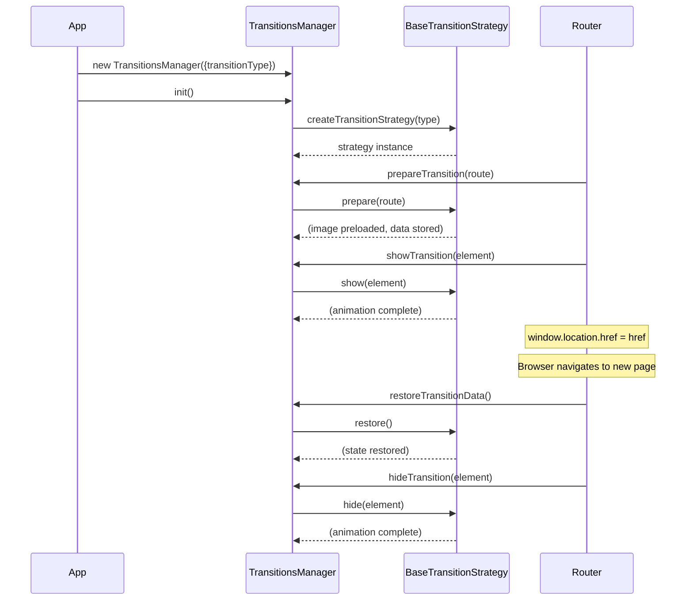
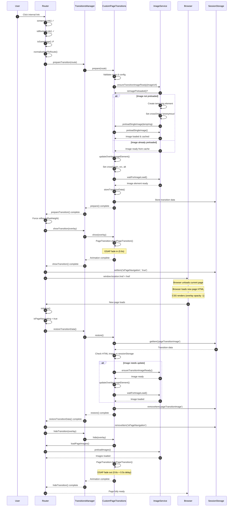
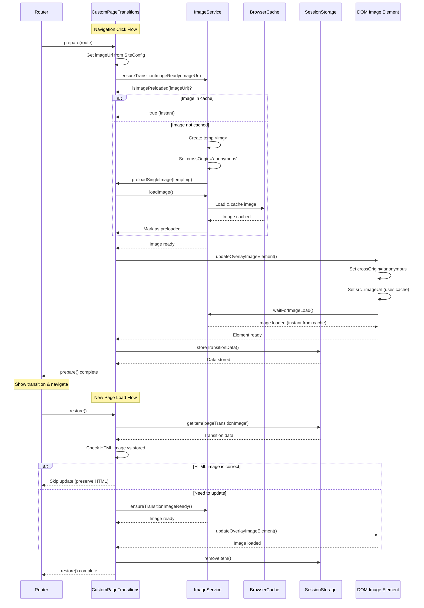

# Page Transition Implementation Techniques

## Overview

This document explains the techniques and optimizations used in `MPAPageTransition.js` to ensure seamless page transitions without visual flashes or broken images.

## Key Problem: Race Condition Between CSS and JavaScript

**The Challenge:**
- Page HTML loads → CSS renders → Overlay starts at `opacity: 0` (default)
- JavaScript runs → Sets overlay to `opacity: 1` 
- **Gap between CSS render and JavaScript execution** → Page content (blue background) flashes through

**The Solution:**
Set overlay to `opacity: 1` by default in CSS, eliminating the race condition entirely.

## Technique 1: CSS-First Visibility (Eliminates Race Condition)

**Location:** `styles/components/_page-transitions.scss`

```scss
.page-transition-overlay {
  opacity: 1; /* Visible by default to cover page content immediately */
  /* ... */
}
```

**Why it works:**
- Overlay is visible **immediately** when HTML loads (before JavaScript runs)
- No gap between page render and overlay visibility
- Prevents blue/white background flash completely

**Trade-off:**
- Overlay is visible by default, so we must explicitly hide it when not navigating
- This is handled in `MPAPageTransition.initialize()` when `!isPageNavigating`

## Technique 2: Crossorigin Matching for Cache Usage

**Location:** Multiple places in `MPAPageTransition.js`

```javascript
imageElement.crossOrigin = 'anonymous';
```

**Why it's critical:**
- HTML `<link rel="preload">` uses `crossorigin="anonymous"`
- If `` tag doesn't match, browser treats them as different resources
- Result: Preloaded image is ignored, causing network request and flash

**Where applied:**
- `restoreTransitionData()` - When restoring image from sessionStorage
- `updateTransitionOverlay()` - When updating overlay for navigation
- `initialize()` - When setting up image element

## Technique 3: Preventing Stale sessionStorage Overwrites

**Location:** `restoreTransitionData()` method

```javascript
const htmlHasValidImage = imageElement.src && 
                          imageElement.src !== '' && 
                          imageElement.src !== fallbackImage;
const imageMatchesSessionStorage = imageElement.src === transitionData.image;

if (htmlHasValidImage && !imageMatchesSessionStorage) {
  // Don't overwrite correct HTML image with stale sessionStorage data
  this.sessionStorage.removeItem('pageTransitionImage');
  return;
}
```

**Why it's needed:**
- HTML has correct image from build-time generation
- sessionStorage might have stale image from previous navigation
- Without this check, correct image gets overwritten → flash

**Example scenario:**
1. User visits `/references` → sessionStorage stores `home-theme-desktop.webp`
2. User navigates to `/section-3` → HTML has `section-3-desktop.webp` (correct)
3. Without check: sessionStorage overwrites HTML image → wrong image flashes
4. With check: HTML image is preserved → correct image displays

## Technique 4: Image Readiness Check Before Setting src

**Location:** `restoreTransitionData()` method

```javascript
const imageAlreadyCorrect = imageMatchesSessionStorage && 
                           imageElement.complete && 
                           imageElement.naturalHeight > 0;

if (imageAlreadyCorrect) {
  // Skip unnecessary work - image is already loaded and correct
}
```

**Why it's needed:**
- Prevents redundant `src` assignment
- Setting `src` on an already-loaded image can trigger re-render
- `complete` + `naturalHeight > 0` confirms image is fully loaded and painted

## Technique 5: Force Browser Paint Before Overlay Visibility

**Location:** `initialize()` method (when navigating)

```javascript
if (!imageAfterRestore.complete || imageAfterRestore.naturalHeight === 0) {
  await this.imageService.waitForImageLoad(imageAfterRestore);
}

// Force browser to paint the image
void imageAfterRestore.offsetHeight; // Force layout calculation
await new Promise(resolve => requestAnimationFrame(resolve));
```

**Why it's needed:**
- `complete: true` means image data is loaded, but browser might not have painted it yet
- Reading `offsetHeight` forces layout calculation
- `requestAnimationFrame` ensures paint completes before next operation
- Without this: Image data loaded but not painted → overlay shows but image appears blank/flash

**Note:** With CSS `opacity: 1` by default, this is less critical but still ensures image is painted before overlay becomes visible.

## Technique 6: Fallback Image Loading When Preloader Doesn't Run

**Location:** `initialize()` method (when NOT navigating)

```javascript
if (!Preloader.shouldShow()) {
  await this.loadPageImages();
}
```

**Why it's needed:**
- Preloader only runs on first visit (`!sessionStorage.getItem('preloaderShown')`)
- On reload, preloader doesn't run → page images never get loaded
- This fallback ensures images load even when preloader skips

**Flow:**
1. Hard refresh → Preloader runs → Images loaded ✅
2. Reload → Preloader doesn't run → `loadPageImages()` runs → Images loaded ✅
3. Navigation → Preloader doesn't run → `hideTransition()` calls `loadPageImages()` → Images loaded ✅

## Technique 7: Await hideTransition to Prevent Content Flash

**Location:** `initialize()` method

```javascript
await this.hideTransition();
```

**Why it's needed:**
- `hideTransition()` is async (fades out overlay)
- Without `await`, `initialize()` returns immediately
- Page content becomes visible before overlay finishes hiding → text flash
- With `await`, overlay fully hides before page content shows

## Technique 8: Simple Fade In/Out (No scaleY)

**Location:** `showTransition()` and `hideTransition()` methods

```javascript
// Fade in
this.gsap.to(this.elements.transitionOverlay, {
  opacity: 1,
  duration: 0.6,
  ease: "power2.inOut",
});

// Fade out
this.gsap.to(this.elements.transitionOverlay, {
  opacity: 0,
  duration: 0.6,
  delay: 0.5,
  ease: "power2.inOut",
});
```

**Why removed scaleY:**
- `scaleY` creates vertical slide animation
- Not needed for fade transitions
- Simpler animation = better performance
- Overlay covers full viewport regardless of scaleY

## Summary of Techniques

| Technique | Purpose | Impact |
|----------|---------|--------|
| CSS `opacity: 1` default | Eliminate race condition | **Critical** - Prevents blue flash |
| Crossorigin matching | Use browser cache | **Critical** - Prevents image re-download |
| Prevent stale overwrites | Preserve correct HTML image | **Important** - Prevents wrong image flash |
| Image readiness check | Skip redundant work | **Optimization** - Prevents unnecessary operations |
| Force paint | Ensure image rendered | **Important** - Ensures image visible |
| Fallback image loading | Handle reload case | **Critical** - Prevents broken images |
| Await hideTransition | Prevent content flash | **Important** - Prevents text flash |
| Simple fade animation | Clean UX | **Design choice** - Simpler animation |

## Technique 9: Refactored Image Preloading Architecture

**Location:** `ImageService.ensureTransitionImageReady()` and `MPAPageTransition.updateOverlayImageElement()`

**Refactoring Benefits:**
- Centralized preload logic reduces duplication
- Clear separation of concerns (preloading vs DOM updates)
- Reusable across `updateTransitionOverlay()` and `restoreTransitionData()`
- Reduced complexity: main functions now ~40 lines instead of ~67 lines

**New Architecture:**
```javascript
// Preload logic extracted to ImageService
await imageService.ensureTransitionImageReady(imageUrl, { transitionsManager });

// DOM update logic extracted to helper method
await updateOverlayImageElement(imageElement, imageUrl, altText);
```

**Why it matters:**
- Eliminates duplicate code patterns between functions
- Makes code more testable and maintainable
- Clearer lifecycle: validate → preload → update DOM → verify

## Code Flow Diagram

```
Page Load
├─ CSS: Overlay visible (opacity: 1) ← Eliminates race condition
├─ JavaScript: initialize()
│  ├─ isPageNavigating?
│  │  ├─ YES: Restore image → Wait for load → Force paint → Hide overlay
│  │  └─ NO: Hide overlay → Check preloader → Load images if needed
│  └─ setupListeners() ← Ready for navigation
│
Navigation Click
├─ updateTransitionOverlay() ← Preload image
├─ showTransition() ← Fade in
├─ Navigate to new page
│
New Page Load
├─ CSS: Overlay visible (opacity: 1) ← Already covering content
├─ JavaScript: initialize()
│  ├─ isPageNavigating = true
│  ├─ restoreTransitionData() ← May update image
│  ├─ Wait for image load
│  ├─ Force paint
│  └─ hideTransition() ← Fade out (loads page images)
```

## Image Preload Lifecycle Flowchart

The following flowchart documents the complete lifecycle of `updateTransitionOverlay()` including all edge cases and decision points:



**Edge Cases Handled:**
1. Missing siteConfig or route → Early return with warning
2. No transition data → Early return with warning
3. No image URL → Early return with warning
4. TransitionsManager not available → Falls back to ImageService
5. Image already preloaded → Skips preload step
6. Preload fails → Continues anyway (image may still load)
7. DOM element not found → Returns early
8. Image load fails → Logs warning but completes (non-blocking)

## Testing Checklist

- [ ] Hard refresh → Preloader runs → Images load → Transitions work
- [ ] Reload page → Preloader doesn't run → Images still load → No broken images
- [ ] Navigate between pages → Transition images display correctly → No flash
- [ ] Navigate to unvisited page → Correct image displays → No fallback image flash
- [ ] Navigate after visiting `/references` → Correct page image (not stale) → No wrong image flash

---

## Current Architecture: Router and TransitionsManager

### Separation of Concerns

The page transition system is split into two main components:

**Router.js** - Navigation Logic
- Handles link clicks and event delegation
- Validates and normalizes routes
- Checks for same-page navigation
- Blocks external/mailto/tel links
- Coordinates the transition flow
- Manages sessionStorage navigation flags
- Loads general page images (not transition-specific)

**TransitionsManager.js** - Transition Strategy Coordinator
- Selects transition strategy (generic or custom)
- Delegates to strategy for all transition operations
- Manages overlay element reference
- Provides unified API for Router

**Transition Strategies** - Implementation Details
- **GenericPageTransitions**: Simple fade in/out, no images
- **CustomPageTransitions**: Complex image-based transitions with preloading, caching, sessionStorage

### Architecture Diagram

```mermaid
graph TB
    Router[Router.js<br/>Navigation Logic]
    TM[TransitionsManager.js<br/>Strategy Coordinator]
    Base[BaseTransitionStrategy<br/>Abstract Interface]
    Generic[GenericPageTransitions<br/>Simple Fade]
    Custom[CustomPageTransitions<br/>Image-Based]
    
    Router -->|delegates| TM
    TM -->|selects| Base
    Base <|-- Generic
    Base <|-- Custom
    TM -->|uses| Generic
    TM -->|uses| Custom
```

### Method Responsibilities

**Router Methods:**
- `initialize()` - Setup DOM elements, check navigation state, route to restoration or initial load
- `handleNavigation(href)` - Normalize route, prepare transition, show overlay, navigate
- `handlePageNavigation()` - Restore transition, hide overlay
- `handleInitialLoad()` - Hide overlay, load page images
- `showTransition()` - Delegate to TransitionsManager
- `hideTransition()` - Load page images, delegate to TransitionsManager

**TransitionsManager Methods:**
- `init()` - Initialize overlay element and selected strategy
- `prepareTransition(route)` - Delegate to strategy.prepare()
- `showTransition(element)` - Delegate to strategy.show()
- `hideTransition(element)` - Delegate to strategy.hide()
- `restoreTransition()` - Delegate to strategy.restore()
- `updateTransitionOverlayFromRoute(route)` - Alias for prepareTransition()
- `restoreTransitionData()` - Alias for restoreTransition()
- `storeTransitionData(data)` - Delegate to custom strategy if available

**Strategy Interface (BaseTransitionStrategy):**
- `prepare(route)` - Prepare transition for route (preload images, setup data)
- `show(element)` - Show transition overlay with animation
- `hide(element)` - Hide transition overlay with animation
- `restore()` - Restore transition state after page navigation

---

## Design Pattern Rationale: Why BaseTransitionStrategy?

### The Problem: Multiple Transition Requirements

The page transition system needed to support different use cases:

1. **Simple Projects**: Need lightweight, fast transitions with minimal overhead
   - No image preloading
   - No sessionStorage persistence
   - Simple fade animations only
   - Minimal JavaScript execution

2. **Rich Projects**: Need sophisticated image-based transitions
   - Image preloading and caching
   - SessionStorage for state persistence
   - Template management
   - Complex image readiness checks
   - Visual continuity between pages

3. **Future Projects**: May need entirely different transition types
   - Slide animations
   - 3D transitions
   - Route-specific transitions
   - A/B testing different transition styles

### Problems Without a Strategy Pattern

**Problem 1: Code Duplication**
Without a strategy pattern, Router would need to handle both transition types directly:
```javascript
// BAD: Router knows about all transition types
if (transitionType === 'generic') {
  // Generic transition logic
  await fadeIn();
} else if (transitionType === 'custom') {
  // Custom transition logic
  await preloadImage();
  await updateOverlay();
  await storeData();
  await fadeIn();
}
```
This violates the **Open/Closed Principle** - Router must be modified every time a new transition type is added.

**Problem 2: Tight Coupling**
Router would be tightly coupled to transition implementation details:
- Router would need to know about image preloading
- Router would need to know about sessionStorage keys
- Router would need to know about template management
- Changes to transition logic would require Router changes

**Problem 3: Testing Complexity**
Testing Router would require:
- Mocking image loading services
- Mocking sessionStorage
- Setting up transition templates
- Testing both transition types in every Router test

**Problem 4: Runtime Flexibility**
Switching transition types would require:
- Conditional logic throughout Router
- Recompiling/bundling different Router versions
- Complex configuration management

### Solution: Strategy Pattern with BaseTransitionStrategy

The Strategy Pattern solves all these problems by:

1. **Encapsulating Variation**: Each transition type is encapsulated in its own class
2. **Defining Common Interface**: `BaseTransitionStrategy` ensures all strategies implement the same methods
3. **Delegating Responsibility**: Router delegates to TransitionsManager, which delegates to the selected strategy
4. **Enabling Polymorphism**: Router code works with any strategy without knowing implementation details

### Why BaseTransitionStrategy is the Best Approach

**1. Enforces Contract**
```javascript
// BaseTransitionStrategy.js
async prepare(route) {
  throw new Error('prepare() must be implemented by subclass');
}
```
- Forces all strategies to implement required methods
- Prevents incomplete implementations
- Makes the interface explicit and discoverable

**2. Provides Common Dependencies**
```javascript
constructor({ siteConfig, sessionStorage, overlayElement }) {
  this.siteConfig = siteConfig;
  this.sessionStorage = sessionStorage;
  this.overlayElement = overlayElement;
}
```
- All strategies receive the same dependencies
- Consistent initialization pattern
- Reduces boilerplate in subclasses

**3. Enables Type Safety (Future)**
- Base class defines the contract
- TypeScript/JSdoc can validate implementations
- IDE autocomplete works correctly
- Refactoring tools can find all implementations

**4. Supports Composition**
- Strategies can compose other strategies
- Strategies can share common utilities (e.g., `FadeInOutAnimation`)
- Strategies can extend base functionality without modifying base class

**5. Simplifies Testing**
```javascript
// Test Router with mock strategy
class MockTransitionStrategy extends BaseTransitionStrategy {
  async prepare() { /* test implementation */ }
  async show() { /* test implementation */ }
  async hide() { /* test implementation */ }
  async restore() { /* test implementation */ }
}
```
- Router tests don't need real transition implementations
- Strategy tests are isolated and focused
- Easy to test edge cases with custom mock strategies

**6. Enables Runtime Strategy Selection**
```javascript
// App.js - Select strategy at initialization
this.transitionsManager = new TransitionsManager({ 
  transitionType: TRANSITION_TYPES.CUSTOM // or GENERIC
});
```
- Strategy selected once at app initialization
- No conditional logic in Router
- Easy to switch strategies via configuration

**7. Supports Future Extensibility**
Adding a new transition type requires:
- Creating new class extending `BaseTransitionStrategy`
- Implementing four methods: `prepare()`, `show()`, `hide()`, `restore()`
- Adding one case to `TransitionsManager.createTransitionStrategy()`
- **No changes to Router.js**

### Comparison: With vs Without Strategy Pattern

| Aspect | Without Strategy Pattern | With BaseTransitionStrategy |
|--------|-------------------------|----------------------------|
| **Router Complexity** | High (knows all transition types) | Low (knows only interface) |
| **Adding New Type** | Modify Router + add conditionals | Extend BaseTransitionStrategy |
| **Testing Router** | Mock all transition types | Mock one interface |
| **Code Duplication** | High (logic scattered) | Low (encapsulated per strategy) |
| **Coupling** | Tight (Router → all types) | Loose (Router → interface) |
| **Maintainability** | Low (changes affect Router) | High (changes isolated) |

### Real-World Benefits

**Scenario 1: Switching Transition Types**
```javascript
// Change one line in App.js
transitionType: TRANSITION_TYPES.GENERIC // Was CUSTOM
```
- Router code unchanged
- No conditional logic needed
- No performance overhead from unused code

**Scenario 2: Adding New Transition Type**
```javascript
// 1. Create SlidePageTransitions.js
export class SlidePageTransitions extends BaseTransitionStrategy {
  async prepare(route) { /* slide-specific prep */ }
  async show(element) { /* slide animation */ }
  async hide(element) { /* slide animation */ }
  async restore() { /* slide-specific restore */ }
}

// 2. Add to TransitionsManager
case TRANSITION_TYPES.SLIDE:
  return new SlidePageTransitions(options);

// Done! Router works immediately.
```

**Scenario 3: Testing Edge Cases**
```javascript
// Create test strategy that simulates slow image loading
class SlowImageStrategy extends CustomPageTransitions {
  async prepare(route) {
    await super.prepare(route);
    await new Promise(resolve => setTimeout(resolve, 1000)); // Simulate delay
  }
}
```
- Test Router behavior with slow transitions
- No need to modify production code
- Isolated test scenarios

### Design Principles Applied

1. **Single Responsibility Principle**: Each strategy handles one transition type
2. **Open/Closed Principle**: Open for extension (new strategies), closed for modification (Router)
3. **Dependency Inversion**: Router depends on abstraction (BaseTransitionStrategy), not concrete implementations
4. **Interface Segregation**: BaseTransitionStrategy defines minimal, focused interface
5. **Liskov Substitution**: Any strategy can replace another without breaking Router

### Conclusion

`BaseTransitionStrategy` is the best approach because it:
- **Eliminates code duplication** by encapsulating transition logic per type
- **Reduces coupling** between Router and transition implementations
- **Enables extensibility** without modifying existing code
- **Simplifies testing** with isolated, mockable strategies
- **Provides runtime flexibility** for strategy selection
- **Enforces consistency** through a common interface
- **Supports future growth** with minimal architectural changes

The Strategy Pattern, implemented through `BaseTransitionStrategy`, transforms page transitions from a monolithic, hard-to-maintain system into a flexible, extensible architecture that can grow with project needs.

---

## Transition Strategy Pattern

### Strategy Selection

TransitionsManager uses the Strategy pattern to support multiple transition types:

```javascript
// In App.js
this.transitionsManager = new TransitionsManager({ 
  siteConfig: this.siteConfig,
  sessionStorage: window.sessionStorage,
  transitionType: TRANSITION_TYPES.CUSTOM // or TRANSITION_TYPES.GENERIC
});
```

### Strategy Types

**GenericPageTransitions** (`TRANSITION_TYPES.GENERIC`)
- Simple fade in/out animation
- No image preloading
- No sessionStorage persistence
- Minimal overhead
- Suitable for projects wanting fast, lightweight transitions

**CustomPageTransitions** (`TRANSITION_TYPES.CUSTOM`)
- Image-based transitions with preloading
- SessionStorage persistence for image URLs
- Template management
- Image caching and tracking
- Suitable for projects wanting rich visual continuity

### Strategy Flow



## Complete Timing Sequence: Click to Page Load

The following sequence diagram shows the complete flow from user click to new page display, including all timing and browser events:



## Image Loading & Caching Flow (Custom Transitions)

For custom transitions, the image loading and caching flow is critical for smooth transitions:



## Browser Navigation Events Timeline

Understanding how `window.location.href` affects the transition flow:

```mermaid
gantt
    title Page Transition Timeline
    dateFormat X
    axisFormat %Ls
    
    section Current Page
    Click Handler          :0, 100
    Prepare Transition     :100, 200
    Show Overlay           :200, 800
    Set Navigation Flag    :800, 850
    window.location.href   :850, 900
    
    section Browser
    Unload Current Page    :900, 1000
    Load New HTML          :1000, 1500
    CSS Render (opacity:1) :1500, 1600
    
    section New Page
    Router.initialize()    :1600, 1700
    Restore Transition     :1700, 2000
    Hide Overlay           :2000, 3100
    Page Ready             :3100, 3200
```

### Critical Timing Points

1. **Before Navigation (Current Page)**
   - Image must be preloaded and ready
   - Overlay must be visible (opacity: 1)
   - SessionStorage flag set: `isPageNavigation = 'true'`

2. **During Navigation (Browser)**
   - Current page unloads
   - New page HTML loads
   - CSS renders overlay at `opacity: 1` (prevents flash)

3. **After Navigation (New Page)**
   - Router.initialize() detects `isPageNavigating = true`
   - Restores transition data from sessionStorage
   - Ensures image is painted
   - Hides overlay with animation

### Browser Event Sequence

```
User Click
  ↓
Router.handleNavigation()
  ↓
TransitionsManager.prepareTransition()
  ↓ (image preloaded, data stored)
Router.showTransition()
  ↓ (overlay fades in: 0.6s)
sessionStorage.setItem('isPageNavigation', 'true')
  ↓
window.location.href = href
  ↓
[Browser unloads current page]
  ↓
[Browser loads new page HTML]
  ↓
CSS renders (overlay opacity: 1 by default)
  ↓
Router.initialize()
  ↓
TransitionsManager.restoreTransitionData()
  ↓ (image restored, painted)
Router.hideTransition()
  ↓ (overlay fades out: 0.6s + 0.5s delay)
Page fully ready
```

## Strategy-Specific Flows

### Generic Transition Flow

```
Click → prepare() [no-op] → show() [fade in] → Navigate → restore() [no-op] → hide() [fade out]
```

### Custom Transition Flow

```
Click → prepare() [preload image, update DOM, store data] → show() [fade in] → Navigate → restore() [restore image, verify, paint] → hide() [fade out]
```

## Key Design Decisions

1. **Strategy Pattern**: Allows switching between generic and custom without changing Router code
2. **Delegation**: TransitionsManager delegates all operations to strategies
3. **SessionStorage**: Only custom transitions use sessionStorage for image persistence
4. **Image Preloading**: Only custom transitions preload images
5. **Template System**: Only custom transitions use HTML templates
6. **Project-Level Configuration**: One transition type per project (not per-route)
