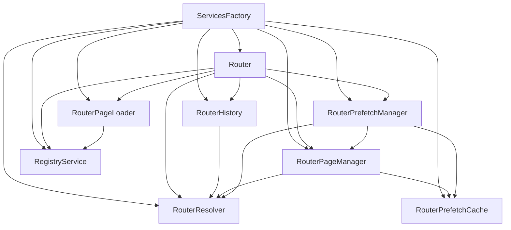

# Router Architecture (SPA Navigation)

## Table of Contents
- [Overview](#overview)
- [How the router modules work together](#how-the-router-modules-work-together)
- [Primary navigation flows](#primary-navigation-flows)
  - [Click navigation](#click-navigation)
  - [Back/forward navigation (History API)](#backforward-navigation-history-api)
  - [Hover/focus prefetch](#hoverfocus-prefetch)
- [Class reference](#class-reference)
  - [`Router`](#router)
  - [`RouterResolver`](#routerresolver)
  - [`RouteValidationResult`](#routevalidationresult)
  - [`RouterHistory`](#routerhistory)
  - [`RouterPageManager`](#routerpagemanager)
  - [`RouterPageLoader`](#routerpageloader)
  - [`RegistryService`](#registryservice)
  - [`RouterPrefetchCache`](#routerprefetchcache)
  - [`RouterPrefetchManager`](#routerprefetchmanager)
- [Where page lifecycle hooks fit](#where-page-lifecycle-hooks-fit)
- [Notes / future improvements](#notes--future-improvements)

## Overview

This app uses a small SPA-style router to intercept clicks on `a.internal-link`, fetch the next page’s HTML, patch `<main>`, and instantiate the correct `Page` class.

The router system lives in `app/router/` and is wired up in `app/services/ServicesFactory.js`.

Key goals:
- Single click listener (event delegation) for internal navigation
- Route validation and normalization in one place
- Centralized History API management
- Separation between **fetching/updating markup** vs **loading page classes** vs **orchestrating navigation**
- Optional prefetch of HTML on user intent (hover/focus)

## How the router modules work together

High-level dependency graph:

## Primary navigation flows

### Click navigation

1. **User clicks** a link matching `SELECTORS.INTERNAL_LINK` (`a.internal-link`)
2. `Router.setupLinkListeners()` delegates to `Router.handleLinkClick()`
3. `Router.beforePageUpdate(href)` validates the route via `RouterResolver.validateRoute()`
4. `Router.startPageUpdate(routeInfo)` orchestrates “leave” → “swap markup” → “load next page”
   - Current page instance is retrieved from `RegistryService.getCurrentPage()`
   - Current page runs `Page.hide(route)`:
     - `beforeHide` hook (optional)
     - `TransitionsService.updateTransitionOverlay(route)`
     - `TransitionsService.showPageTransition(overlay)`
     - `Page.destroy()` cleanup
     - `afterHide` hook (optional)
   - `RouterPageManager.updatePage(route)` fetches HTML (or uses prefetched cache), parses and swaps `<main>` content
   - `RouterHistory.updateHistory(route)` pushes browser history state
   - `RouterPageLoader.getPage(route)` loads the page class and constructs the new page instance
5. `Router.afterPageUpdate(newPage, routeInfo)` runs:
   - `newPage.create()` (lifecycle hooks: `beforeCreate`/`afterCreate`)
   - `newPage.show()` (lifecycle hooks: `beforeShow`/`afterShow`) and hides transition overlay

### Back/forward navigation (History API)

1. `RouterHistory` registers a `popstate` listener
2. On back/forward, `RouterHistory.handlePopState()` dispatches `EVENTS.HISTORY_NAVIGATION`
3. `Router` listens for `EVENTS.HISTORY_NAVIGATION` and calls its history navigation handler
4. The router runs the same “hide → swap markup → load page → show” pipeline, but **does not push new history**

### Hover/focus prefetch

1. `Router.start()` calls `prefetchManager.init()` (optional feature)
2. `RouterPrefetchManager` listens for:
   - `mouseover` / `mouseout` on `a.internal-link` (delegated)
   - `focusin` / `focusout` for keyboard users
3. After a short delay (`VALUES.PREFETCH_HOVER_DELAY_MS`), it calls:
   - `RouterResolver.validateRoute(href, currentPath)`
   - `RouterPageManager.requestPage(route, { useCache: false })`
4. The returned HTML is stored in `RouterPrefetchCache`
5. On click navigation, `RouterPageManager.requestPage(route)` checks the cache first and returns the prefetched HTML immediately when present

## Class reference

### `Router`

**File**: `app/router/Router.js`

**Responsibility**: Orchestrates navigation.
- Intercepts clicks on internal links
- Validates routes and handles “skip / external / redirect” outcomes
- Coordinates the navigation pipeline:
  - hide current page
  - update page markup
  - update history
  - load and show next page
- Listens for history navigation events and routes them through the same pipeline
- Bootstraps optional prefetch

### `RouterResolver`

**File**: `app/router/RouterResolver.js`

**Responsibility**: Validate and normalize route strings.
- Builds `validRoutes` from `SiteConfig`
- Converts hrefs to route keys used by the router
- Returns a `RouteValidationResult` describing what the router should do:
  - valid route
  - skip navigation
  - external link
  - redirect home

### `RouteValidationResult`

**File**: `app/router/RouterValidation.js`

**Responsibility**: Small data object representing route validation outcomes.
- `isValid` plus an optional `action` and route/url payload
- Used by `Router` and `RouterResolver` to keep branching logic explicit

### `RouterHistory`

**File**: `app/router/RouterHistory.js`

**Responsibility**: Centralized History API handling.
- Sets initial history state on first load
- Updates history via push/replace operations
- Listens to `popstate` and emits `EVENTS.HISTORY_NAVIGATION` for the router to handle

### `RouterPageManager`

**File**: `app/router/RouterPageManager.js`

**Responsibility**: Fetch HTML and swap markup.
- Fetches the next page’s HTML (route → URL via `SiteConfig`)
- Parses HTML with `DOMParser`
- Extracts metadata (`data-template`, `data-background`, `data-color`)
- Updates `<main>` contents and applies updated attributes/classes
- Preloads images and triggers layout updates (`resize`, background colors)

**Prefetch integration**:
- If a `RouterPrefetchCache` is set, `requestPage()` will serve cached HTML when available

### `RouterPageLoader`

**File**: `app/router/RouterPageLoader.js`

**Responsibility**: Load page classes and create page instances.
- Loads page module for a route (dynamic import based on `SiteConfig.getClass(route)`)
- Caches page classes in `RegistryService`
- Constructs the page instance and injects dependencies (smoothScroll, animations, transitions, footnotes)
- Sets the current page in `RegistryService`

### `RegistryService`

**File**: `app/services/RegistryService.js`

**Responsibility**: Registry for page classes and current page instance.
- Stores page classes in a `Map<route, PageClass>`
- Tracks the current page instance
- Used by `RouterPageLoader` to cache classes and by `Router` to get the current page during navigation

### `RouterPrefetchCache`

**File**: `app/router/RouterPrefetchCache.js`

**Responsibility**: In-memory HTML cache for prefetched pages.
- TTL expiration
- Simple LRU eviction (based on Map insertion order)
- Stores `{ html, timestamp, metadata }`

### `RouterPrefetchManager`

**File**: `app/router/RouterPrefetchManager.js`

**Responsibility**: Event-driven prefetch coordinator.
- Uses event delegation for `mouseover/mouseout` and `focusin/focusout`
- Prefetches only after a short delay to avoid prefetching accidental hovers
- Stores prefetched HTML in `RouterPrefetchCache`

## Where page lifecycle hooks fit

The router does not directly manage animation sequencing beyond invoking `Page.hide()` and `Page.show()`.

The **Page lifecycle hooks** are the main integration point for page-specific behavior:
- Use `beforeHide()` to run exit animations before the transition overlay appears
- Use `afterShow()` to run entrance animations after the transition overlay hides

See: `documentation/guides/PAGE_LIFECYCLE.md`

## Notes / future improvements

- **Prefetch strategy**: current implementation is “hover/focus intent”. You could extend this with a Strategy pattern (hover vs viewport vs idle).
- **Cache invalidation**: prefetch cache is TTL-based; add explicit invalidation if pages can change frequently.
- **Abort/cancel**: `RouterPageManager` uses an AbortController for fetch; prefetch could optionally share a separate controller for best isolation.
- **LRU refinement**: current LRU is Map-order based. If you need true LRU + hit counting, consider a small dedicated LRU list.

